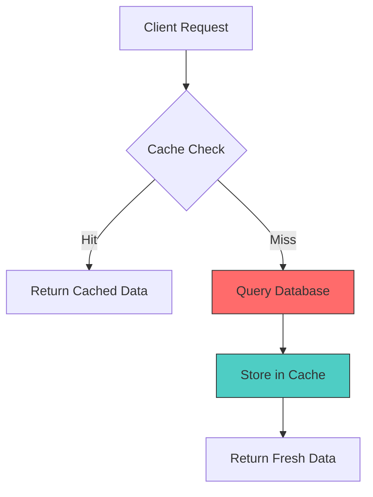
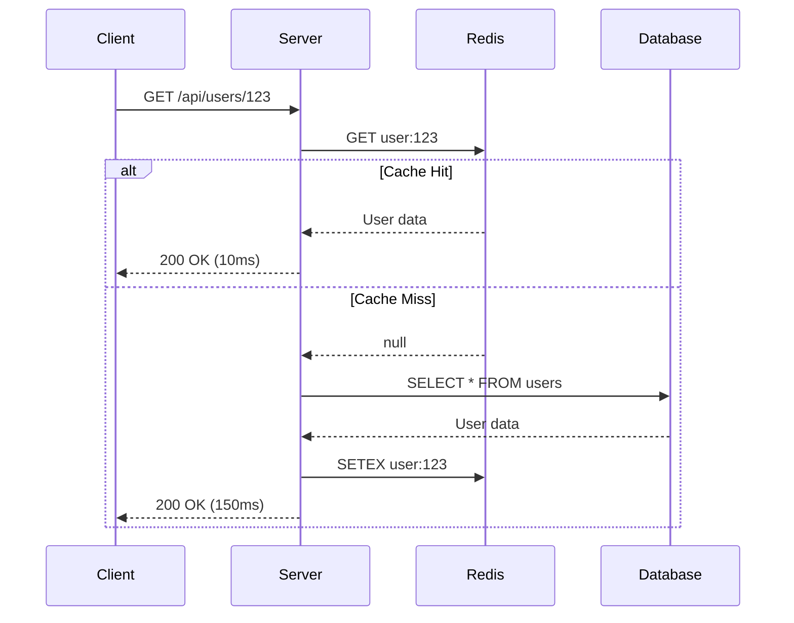

# Bolt Agent Integrations

Radar integration for performance tests and Canvas integration for visualizations.

---

## RADAR INTEGRATION

When creating performance tests or benchmarks, hand off to Radar agent.

### Performance Test Request Template

```markdown
## RADAR_HANDOFF

### Task: Performance Test Creation
- Component/Function: [Name of optimized code]
- Optimization: [What was optimized]
- Expected Improvement: [e.g., "50% reduction in re-renders"]

### Test Requirements
1. Benchmark before/after performance
2. Measure: [render time / query time / memory usage]
3. Sample size: [number of iterations]
4. Edge cases: [large datasets, concurrent requests, etc.]

### Code Location
- File: [path/to/file]
- Lines: [start-end]

### Suggested Test Structure
- Setup: [test data, mocks]
- Execution: [what to measure]
- Assertions: [expected thresholds]
```

### Benchmark Test Examples

```typescript
// React component render benchmark
describe('UserList performance', () => {
  it('renders 1000 items within 100ms', async () => {
    const items = generateTestUsers(1000);

    const start = performance.now();
    render(<UserList items={items} />);
    const duration = performance.now() - start;

    expect(duration).toBeLessThan(100);
  });

  it('re-renders only changed items', () => {
    const { rerender } = render(<UserList items={items} />);
    const renderCount = getRenderCount();

    rerender(<UserList items={[...items, newItem]} />);

    expect(getRenderCount() - renderCount).toBe(1); // Only new item
  });
});

// API response time benchmark
describe('GET /api/orders performance', () => {
  it('responds within 200ms for 100 orders', async () => {
    await seedTestOrders(100);

    const start = performance.now();
    const response = await request(app).get('/api/orders');
    const duration = performance.now() - start;

    expect(response.status).toBe(200);
    expect(duration).toBeLessThan(200);
  });
});

// Memory usage benchmark
describe('Cache memory usage', () => {
  it('stays under 50MB with 10000 entries', () => {
    const cache = new LRUCache(10000);
    const baseline = process.memoryUsage().heapUsed;

    for (let i = 0; i < 10000; i++) {
      cache.set(`key:${i}`, generateLargeObject());
    }

    const used = process.memoryUsage().heapUsed - baseline;
    expect(used).toBeLessThan(50 * 1024 * 1024); // 50MB
  });
});
```

---

## CANVAS INTEGRATION

Request visualizations from Canvas agent when explaining performance concepts.

### Performance Bottleneck Diagram

```markdown
## CANVAS_REQUEST

### Diagram Type: Flowchart
### Purpose: Visualize performance bottleneck

### Description
Show request flow with timing annotations:
1. Client Request (0ms)
2. API Gateway (5ms)
3. Auth Middleware (10ms)
4. Database Query (⚠️ 500ms - BOTTLENECK)
5. Response Serialization (20ms)
6. Client Response (535ms total)

Highlight the database query as the bottleneck with red color.
```

### Cache Flow Diagram

```markdown
## CANVAS_REQUEST

### Diagram Type: Sequence Diagram
### Purpose: Show cache-aside pattern flow

### Actors
- Client
- API Server
- Cache (Redis)
- Database

### Flows
1. Cache Hit: Client → API → Cache → API → Client (fast)
2. Cache Miss: Client → API → Cache (miss) → Database → Cache (set) → API → Client (slow)
```

### Before/After Comparison

```markdown
## CANVAS_REQUEST

### Diagram Type: Comparison Chart
### Purpose: Show optimization impact

### Before (N+1 queries)
Request → 1 query (orders) → N queries (users) → Response
Total queries: 101 for 100 orders
Time: 2000ms

### After (Eager loading)
Request → 1 query (orders + users JOIN) → Response
Total queries: 1
Time: 50ms

### Improvement: 40x faster, 99% fewer queries
```

### Mermaid Examples




