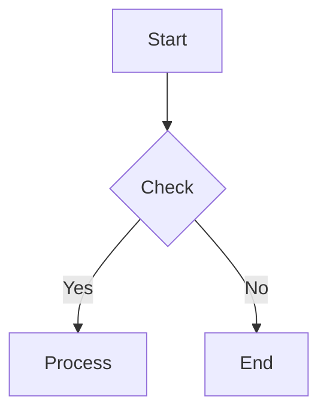

# Canvas Accessibility Reference

色覚多様性対応、代替テキスト生成、アクセシブルな図の作成ガイド。

---

## Overview

アクセシブルな図を作成するための3つの柱:

1. **Color Accessibility** - 色覚多様性対応パレット
2. **Alt Text Generation** - スクリーンリーダー向け代替テキスト
3. **Format Fallbacks** - ASCII Art への自動フォールバック

---

## Color Accessibility

### Color Vision Deficiency Types

| タイプ | 説明 | 影響を受ける色 | 人口比率 |
|--------|------|---------------|---------|
| Protanopia | 赤色盲 | 赤-緑 | 1% |
| Deuteranopia | 緑色盲 | 赤-緑 | 1% |
| Tritanopia | 青色盲 | 青-黄 | 0.01% |
| Achromatopsia | 全色盲 | 全色 | 0.003% |

### Color-Blind Safe Palette

#### Primary Palette (8 colors)

| 用途 | 標準色 | Hex | CVD Safe | Description |
|------|--------|-----|----------|-------------|
| Process | Blue | #4477AA | ✅ | 処理ステップ |
| Success | Teal | #228833 | ✅ | 成功/完了 |
| Warning | Yellow | #CCBB44 | ✅ | 警告/注意 |
| Error | Orange | #EE6677 | ✅ | エラー/失敗 |
| Info | Cyan | #66CCEE | ✅ | 情報 |
| Neutral | Gray | #BBBBBB | ✅ | 中立/デフォルト |
| Highlight | Purple | #AA3377 | ✅ | 強調 |
| Secondary | Light Blue | #99DDFF | ✅ | 二次要素 |

#### Mermaid Theme Configuration

```mermaid
%%{init: {
  'theme': 'base',
  'themeVariables': {
    'primaryColor': '#4477AA',
    'primaryTextColor': '#FFFFFF',
    'primaryBorderColor': '#2255AA',
    'secondaryColor': '#228833',
    'tertiaryColor': '#CCBB44',
    'errorColor': '#EE6677',
    'lineColor': '#333333',
    'textColor': '#333333'
  }
}}%%
```

#### draw.io Color Styles

```xml
<!-- Color-blind safe styles -->
<mxCell style="fillColor=#4477AA;strokeColor=#2255AA;fontColor=#FFFFFF;" /> <!-- Process -->
<mxCell style="fillColor=#228833;strokeColor=#116622;fontColor=#FFFFFF;" /> <!-- Success -->
<mxCell style="fillColor=#CCBB44;strokeColor=#AA9922;fontColor=#333333;" /> <!-- Warning -->
<mxCell style="fillColor=#EE6677;strokeColor=#CC4455;fontColor=#FFFFFF;" /> <!-- Error -->
```

### Pattern + Color Strategy

色だけでなくパターンも併用して区別:

```
┌─────────────┐  ┌═════════════┐  ┌─ ─ ─ ─ ─ ─┐
│   Solid     │  ║   Double    ║  │   Dashed   │
│   (Normal)  │  ║   (Success) ║  │   (Pending)│
└─────────────┘  └═════════════┘  └─ ─ ─ ─ ─ ─┘
```

### Shape Differentiation

色に加えて形状で区別:

| 意味 | 形状 | 色 | 組み合わせ |
|------|------|-----|-----------|
| Start | 楕円 | Green | ○ + Green |
| Process | 四角 | Blue | □ + Blue |
| Decision | ひし形 | Yellow | ◇ + Yellow |
| Error | 八角形 | Red | ⬡ + Red |
| End | 二重楕円 | Gray | ◎ + Gray |

---

## Alt Text Generation

### Automatic Alt Text Structure

```markdown
## Diagram Alt Text

**Type**: [Diagram type]
**Title**: [Diagram title]
**Summary**: [1-2 sentence overview]

**Structure**:
[Hierarchical or sequential description]

**Key Relationships**:
- [Entity A] → [Entity B]: [Relationship]
- [Entity B] → [Entity C]: [Relationship]

**Notable Points**:
- [Important observation 1]
- [Important observation 2]
```

### Examples by Diagram Type

#### Flowchart Alt Text

```markdown
**Type**: Flowchart
**Title**: User Authentication Flow
**Summary**: ユーザーログインから認証完了までの5ステップのプロセスフロー

**Structure**:
1. Start: ログインページ表示
2. Input: ユーザーがメールとパスワードを入力
3. Decision: 認証情報が正しいか？
   - Yes → ダッシュボードへリダイレクト
   - No → エラーメッセージ表示 → 入力に戻る
4. End: 認証完了

**Key Relationships**:
- ログインフォーム → 認証API: POST /api/auth/login
- 認証成功 → セッション作成: JWT token発行
```

#### ER Diagram Alt Text

```markdown
**Type**: ER Diagram
**Title**: E-Commerce Database Schema
**Summary**: ECサイトの主要4テーブル（User, Order, Product, OrderItem）の関係

**Entities**:
- User: id(PK), email(UK), name, created_at
- Order: id(PK), user_id(FK→User), status, total
- Product: id(PK), name, price, stock
- OrderItem: id(PK), order_id(FK→Order), product_id(FK→Product), quantity

**Key Relationships**:
- User 1:N Order (1人のユーザーが複数の注文を持つ)
- Order 1:N OrderItem (1つの注文に複数の商品)
- Product 1:N OrderItem (1つの商品が複数の注文に含まれる)
```

#### Sequence Diagram Alt Text

```markdown
**Type**: Sequence Diagram
**Title**: API Request Flow
**Summary**: クライアントからDBまでの4層アーキテクチャのリクエスト/レスポンスフロー

**Participants** (left to right):
1. Client (ブラウザ/アプリ)
2. API Gateway (認証・ルーティング)
3. Service (ビジネスロジック)
4. Database (データ永続化)

**Message Flow**:
1. Client → API Gateway: HTTP Request
2. API Gateway → Service: Validated Request
3. Service → Database: Query
4. Database → Service: Result
5. Service → API Gateway: Response
6. API Gateway → Client: HTTP Response
```

### Alt Text Trigger

```yaml
questions:
  - question: "アクセシビリティ用の代替テキストを生成しますか？"
    header: "Alt Text"
    options:
      - label: "Yes, generate alt text (Recommended)"
        description: "スクリーンリーダー向けの説明を生成"
      - label: "No, diagram only"
        description: "図のみ出力"
    multiSelect: false
```

---

## ASCII Fallback

視覚的な図を表示できない環境向けの自動フォールバック。

### Auto-Fallback Trigger

```yaml
questions:
  - question: "ASCII版も同時に生成しますか？"
    header: "Fallback"
    options:
      - label: "Yes, include ASCII version (Recommended)"
        description: "ターミナル/プレーンテキスト環境用"
      - label: "No, primary format only"
        description: "指定形式のみ"
    multiSelect: false
```

### Conversion Rules

| Mermaid Element | ASCII Equivalent |
|-----------------|------------------|
| `[Rectangle]` | `┌────────┐` |
| `{Diamond}` | `◇` or `/\  \/` |
| `((Circle))` | `( )` or `O` |
| `-->` | `───>` |
| `-.->` | `- - ->` |
| `subgraph` | `┌─ Title ─┐` |

### Example Conversion

**Mermaid:**


**ASCII Fallback:**
```
┌─────────┐
│  Start  │
└────┬────┘
     │
     ▼
   ┌───┐
   │ ? │ Check
   └─┬─┘
  Yes│ No
  ┌──┴──┐
  ▼     ▼
┌─────┐ ┌─────┐
│Proc │ │ End │
└─────┘ └─────┘
```

---

## Accessibility Checklist

図を生成する際のアクセシビリティチェックリスト:

```
[ ] Color Contrast: テキストと背景のコントラスト比 4.5:1 以上
[ ] Color Independence: 色だけでなく形状/パターンでも区別可能
[ ] Alt Text: 代替テキストが含まれている
[ ] Text Size: テキストは読みやすいサイズ (12px以上)
[ ] ASCII Fallback: プレーンテキスト版が利用可能
[ ] Node Labels: すべてのノードに明確なラベル
[ ] Arrow Labels: 重要な矢印には説明ラベル
[ ] Legend: 凡例が含まれている
```

---

## Output Format with Accessibility

```markdown
## Canvas Diagram (Accessible)

### [Diagram Title]

**Purpose:** [目的]
**Format:** Mermaid (with ASCII fallback)
**Accessibility:** CVD-safe colors, alt text included

### Diagram

\`\`\`mermaid
[Mermaid code with CVD-safe theme]
\`\`\`

### Alt Text

[Structured alt text for screen readers]

### ASCII Fallback

\`\`\`
[ASCII art version]
\`\`\`

### Legend

| Symbol | Meaning | Color |
|--------|---------|-------|
| □ | Process | Blue (#4477AA) |
| ◇ | Decision | Yellow (#CCBB44) |
| ○ | Start/End | Green/Gray |
```

---

## Integration with SKILL.md

SKILL.md の Quality Checklist に追加:

```
Accessibility:
- [ ] CVD-safe colors used
- [ ] Shapes differentiate meaning
- [ ] Alt text included
- [ ] ASCII fallback available (optional)
```
