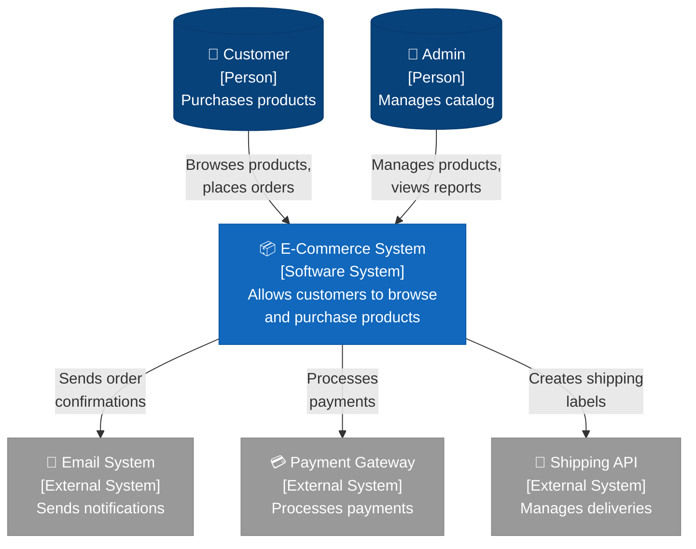
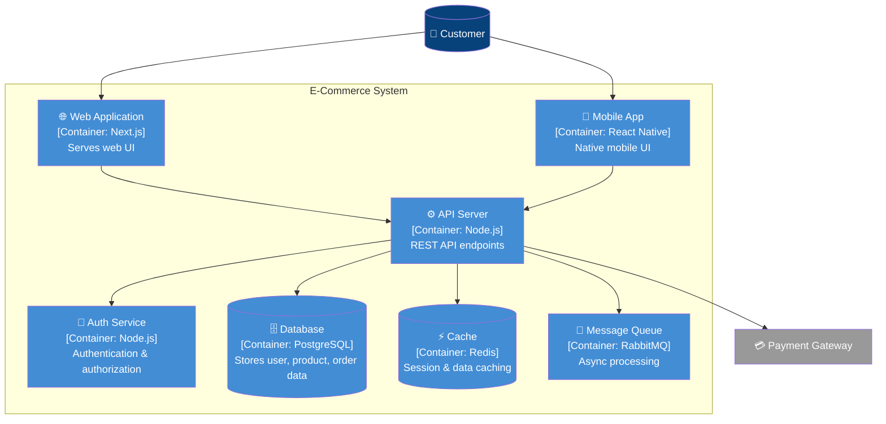
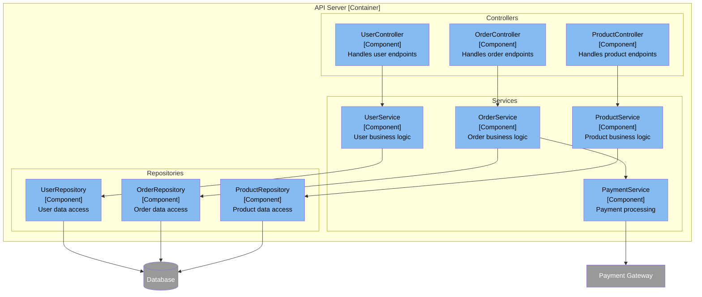
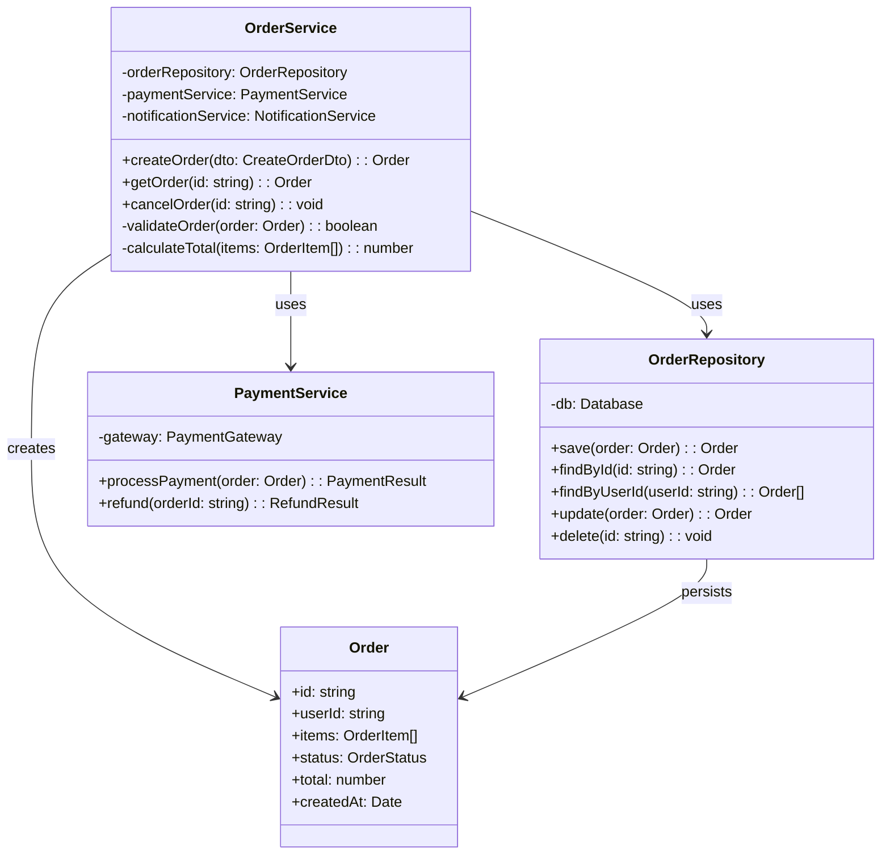
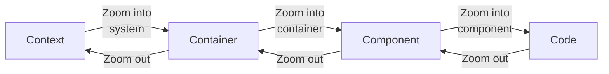

# Canvas C4 Model Reference

C4 Model によるアーキテクチャ図の作成ガイド。

---

## Overview

C4 Model は4つの抽象レベルでシステムを可視化:

```
┌─────────────────────────────────────────────────────────────┐
│  Level 1: CONTEXT                                           │
│  システムと外部アクター（ユーザー、外部システム）の関係      │
└─────────────────────────────────────────────────────────────┘
                              ↓ Zoom In
┌─────────────────────────────────────────────────────────────┐
│  Level 2: CONTAINER                                         │
│  システム内のコンテナ（アプリ、DB、メッセージキュー等）      │
└─────────────────────────────────────────────────────────────┘
                              ↓ Zoom In
┌─────────────────────────────────────────────────────────────┐
│  Level 3: COMPONENT                                         │
│  コンテナ内のコンポーネント（サービス、コントローラー等）    │
└─────────────────────────────────────────────────────────────┘
                              ↓ Zoom In
┌─────────────────────────────────────────────────────────────┐
│  Level 4: CODE                                              │
│  コンポーネント内のコード構造（クラス、関数等）              │
└─────────────────────────────────────────────────────────────┘
```

---

## Trigger Commands

```
/Canvas c4 context                     # Level 1: Context Diagram
/Canvas c4 container                   # Level 2: Container Diagram
/Canvas c4 component [container]       # Level 3: Component Diagram
/Canvas c4 code [component]            # Level 4: Code Diagram
/Canvas c4 all                         # All levels overview
```

---

## Level 1: System Context Diagram

### Purpose

- システムの境界を明確化
- 外部アクター（ユーザー、外部システム）との関係を表示
- ビジネスステークホルダー向け

### Mermaid Template



### ASCII Template

```
                     ┌─────────────────┐
                     │    Customer     │
                     │    [Person]     │
                     └────────┬────────┘
                              │ Browses, Orders
                              ▼
┌─────────────┐      ┌─────────────────┐      ┌─────────────┐
│   Admin     │      │  E-Commerce     │      │   Email     │
│  [Person]   │─────>│    System       │─────>│  [External] │
└─────────────┘      │ [Software Sys]  │      └─────────────┘
   Manages           └────────┬────────┘
                              │
              ┌───────────────┼───────────────┐
              ▼               ▼               ▼
       ┌───────────┐   ┌───────────┐   ┌───────────┐
       │  Payment  │   │ Shipping  │   │  (other)  │
       │ [External]│   │ [External]│   │           │
       └───────────┘   └───────────┘   └───────────┘
```

---

## Level 2: Container Diagram

### Purpose

- システム内の主要なコンテナを表示
- 技術選択を明示
- 開発者・アーキテクト向け

### Mermaid Template



### Container Types

| タイプ | 例 | 記号 |
|--------|-----|------|
| Web Application | Next.js, React | 🌐 |
| Mobile App | React Native, Flutter | 📱 |
| API/Service | Node.js, Go | ⚙️ |
| Database | PostgreSQL, MongoDB | 🗄️ |
| Cache | Redis, Memcached | ⚡ |
| Message Queue | RabbitMQ, Kafka | 📨 |
| File Storage | S3, GCS | 📁 |
| Auth Service | Auth0, Keycloak | 🔐 |

---

## Level 3: Component Diagram

### Purpose

- 特定コンテナ内のコンポーネント構造
- 責務の分離を明示
- 開発者向け

### Mermaid Template (API Server)



---

## Level 4: Code Diagram

### Purpose

- 特定コンポーネントの内部構造
- クラス/関数レベルの設計
- 実装者向け

### Mermaid Class Diagram



---

## C4 Color Palette

| Element | Color | Hex | Usage |
|---------|-------|-----|-------|
| Person | Dark Blue | #08427B | ユーザー、アクター |
| Software System | Blue | #1168BD | 自社システム |
| Container | Light Blue | #438DD5 | アプリ、サービス、DB |
| Component | Lighter Blue | #85BBF0 | 内部コンポーネント |
| External System | Gray | #999999 | 外部システム |

---

## Navigation Between Levels



### Drill-Down Commands

```
/Canvas c4 zoom [element-name]         # 特定要素にズームイン
/Canvas c4 zoom out                    # 一つ上のレベルに戻る
```

---

## C4 Output Format

```markdown
## C4 Diagram: [Level] - [System/Container/Component Name]

### Overview

| Attribute | Value |
|-----------|-------|
| Level | Context / Container / Component / Code |
| Scope | [対象範囲] |
| Audience | [想定読者: Business / Technical / Developer] |

### Diagram

[Mermaid code]

### Elements

| Element | Type | Description |
|---------|------|-------------|
| [Name] | [Person/System/Container/Component] | [説明] |

### Relationships

| From | To | Description |
|------|-----|-------------|
| [Source] | [Target] | [関係の説明] |

### Technology Stack

| Container/Component | Technology |
|--------------------|------------|
| [Name] | [Tech stack] |

### Notes

- [アーキテクチャ決定の理由]
- [将来の拡張計画]
```

---

## Question Templates

### ON_C4_LEVEL

```yaml
questions:
  - question: "どのレベルのC4図を作成しますか？"
    header: "Level"
    options:
      - label: "Context (Recommended for overview)"
        description: "システムと外部の関係を俯瞰"
      - label: "Container"
        description: "システム内のコンテナ構成"
      - label: "Component"
        description: "特定コンテナ内の構造"
      - label: "Code"
        description: "特定コンポーネントの実装"
    multiSelect: false
```

### ON_C4_SCOPE

```yaml
questions:
  - question: "どの範囲を対象にしますか？"
    header: "Scope"
    options:
      - label: "Entire system"
        description: "システム全体"
      - label: "Specific container"
        description: "特定のコンテナを指定"
      - label: "Specific feature"
        description: "特定の機能に関連する部分"
    multiSelect: false
```

### ON_C4_AUDIENCE

```yaml
questions:
  - question: "この図の想定読者は？"
    header: "Audience"
    options:
      - label: "Business stakeholders"
        description: "技術詳細を省略、概念中心"
      - label: "Technical architects"
        description: "技術選択、構造を明示"
      - label: "Developers"
        description: "実装詳細、コードレベル"
    multiSelect: false
```
