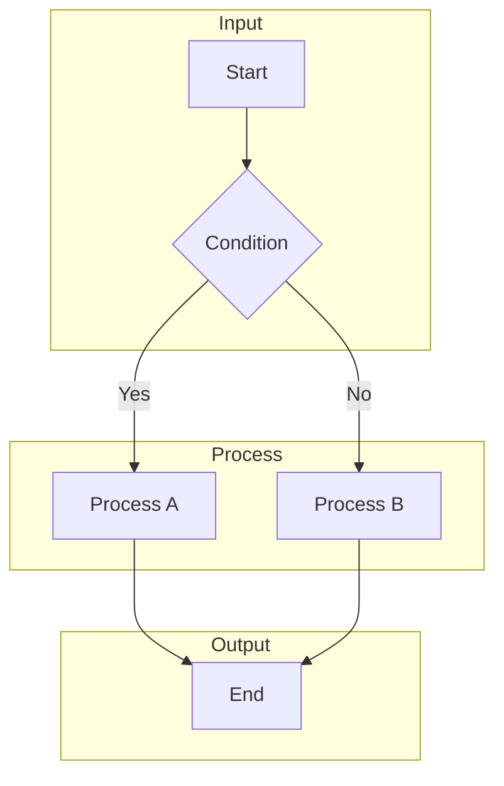
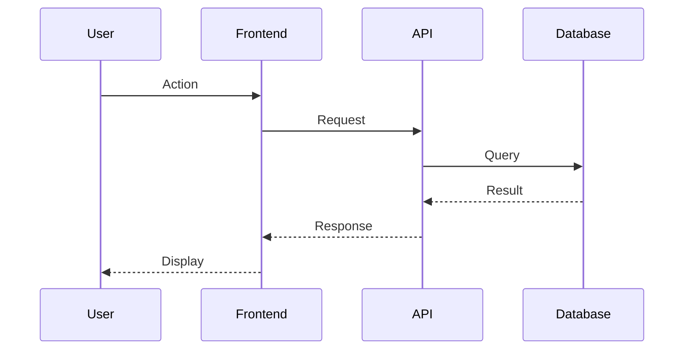
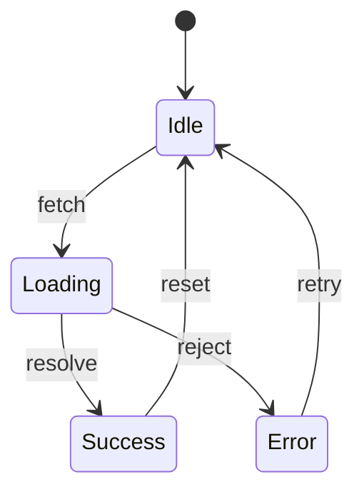
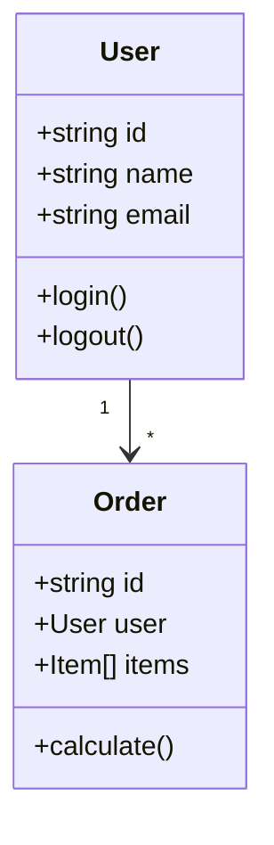
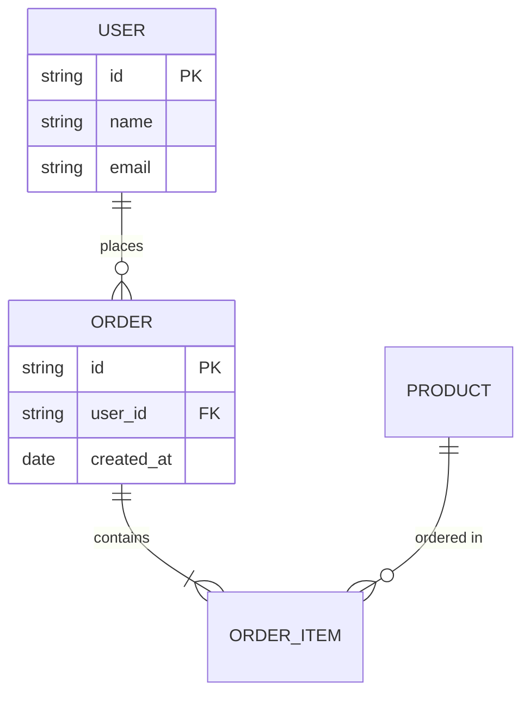
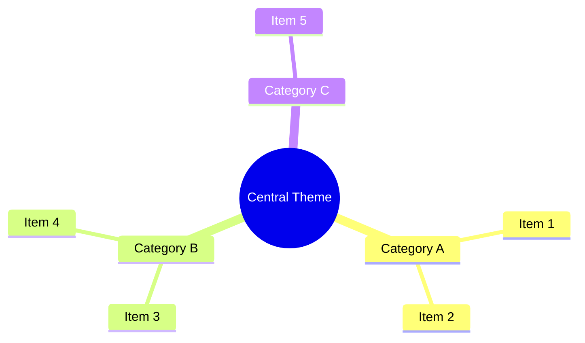
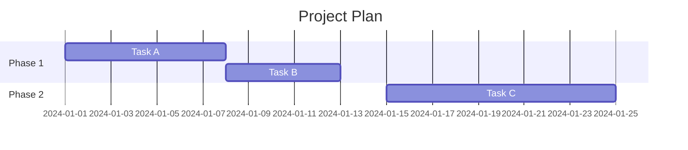
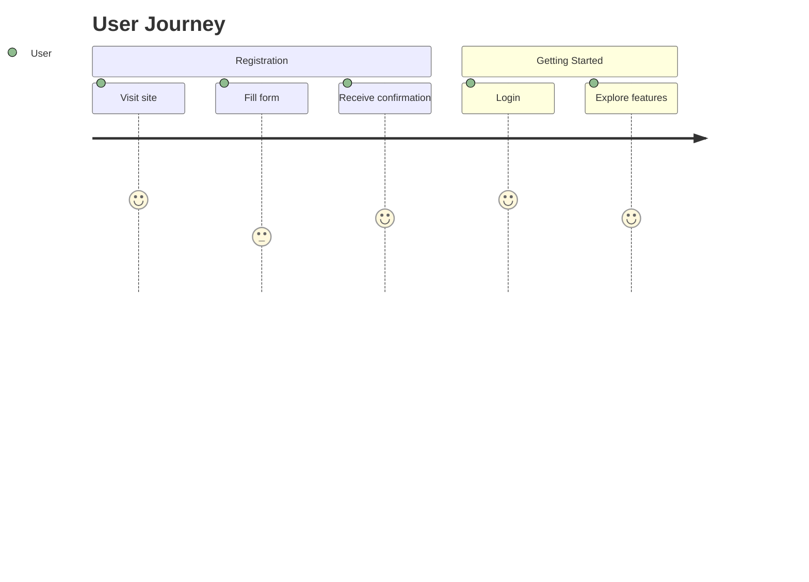

# Canvas Diagram Templates Reference

Complete Mermaid and draw.io templates for common diagram types.

## Flowchart Template

### Mermaid


### draw.io
```xml
<?xml version="1.0" encoding="UTF-8"?>
<mxfile host="Canvas Agent" version="1.0">
  <diagram name="Flowchart" id="flowchart-1">
    <mxGraphModel dx="800" dy="600" grid="1" gridSize="10" guides="1" tooltips="1" connect="1" arrows="1" page="1" pageScale="1" pageWidth="1100" pageHeight="850">
      <root>
        <mxCell id="0"/>
        <mxCell id="1" parent="0"/>
        <mxCell id="start" value="Start" style="ellipse;fillColor=#d5e8d4;strokeColor=#82b366;whiteSpace=wrap;html=1;" vertex="1" parent="1">
          <mxGeometry x="190" y="40" width="120" height="60" as="geometry"/>
        </mxCell>
        <mxCell id="cond" value="Condition" style="rhombus;fillColor=#fff2cc;strokeColor=#d6b656;whiteSpace=wrap;html=1;" vertex="1" parent="1">
          <mxGeometry x="185" y="140" width="130" height="80" as="geometry"/>
        </mxCell>
        <mxCell id="procA" value="Process A" style="rounded=1;fillColor=#dae8fc;strokeColor=#6c8ebf;whiteSpace=wrap;html=1;" vertex="1" parent="1">
          <mxGeometry x="80" y="280" width="120" height="60" as="geometry"/>
        </mxCell>
        <mxCell id="procB" value="Process B" style="rounded=1;fillColor=#dae8fc;strokeColor=#6c8ebf;whiteSpace=wrap;html=1;" vertex="1" parent="1">
          <mxGeometry x="300" y="280" width="120" height="60" as="geometry"/>
        </mxCell>
        <mxCell id="end" value="End" style="ellipse;fillColor=#f8cecc;strokeColor=#b85450;whiteSpace=wrap;html=1;" vertex="1" parent="1">
          <mxGeometry x="190" y="400" width="120" height="60" as="geometry"/>
        </mxCell>
        <!-- Edges omitted for brevity - see full version in SKILL.md -->
      </root>
    </mxGraphModel>
  </diagram>
</mxfile>
```

---

## Sequence Diagram Template

### Mermaid


---

## State Diagram Template

### Mermaid


---

## Class Diagram Template

### Mermaid


---

## ER Diagram Template

### Mermaid


---

## Mind Map Template

### Mermaid


---

## Gantt Chart Template

### Mermaid


---

## Journey Template

### Mermaid


---

## Template Selection Guide

| Diagram Type | Use Case | Key Elements |
|--------------|----------|--------------|
| Flowchart | Process flows | Start/End, Conditions, Processes |
| Sequence | API calls | Participants, Messages, Returns |
| State | Lifecycles | States, Transitions, Triggers |
| Class | Data models | Classes, Attributes, Methods |
| ER | Database | Entities, Relationships, Keys |
| Mind Map | Brainstorming | Central theme, Categories |
| Gantt | Planning | Tasks, Dependencies, Timeline |
| Journey | UX flows | Sections, Steps, Emotion scores |
