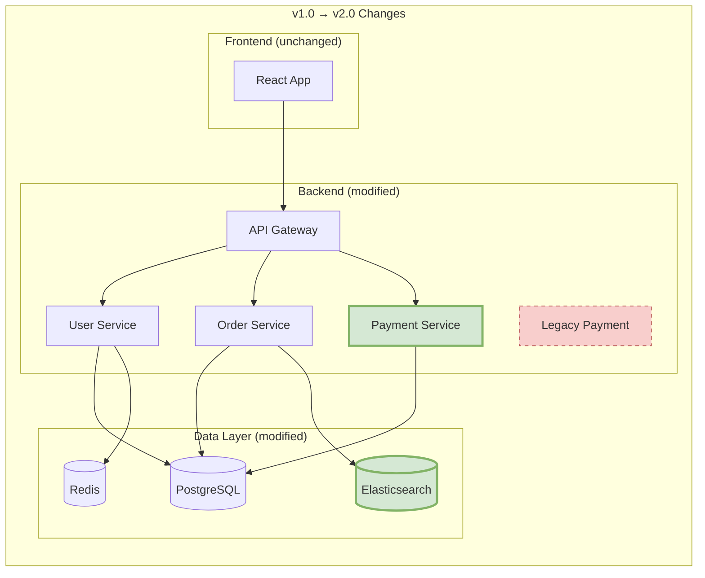

# Canvas Diff Visualization Reference

Before/After 比較、変更の可視化、マイグレーション差分の表現。

---

## Overview

変更を可視化する3つのアプローチ:

1. **Side-by-Side** - 左右並列比較
2. **Overlay** - 重ね合わせ（追加/削除をハイライト）
3. **Timeline** - 時系列変化

---

## Trigger Commands

```
/Canvas diff [file1] [file2]           # 2ファイル比較
/Canvas diff --before [commit]         # コミット前後比較
/Canvas diff schema                    # スキーマ変更を可視化
/Canvas diff architecture              # アーキテクチャ変更を可視化
/Canvas history [diagram-name]         # 保存済み図の変更履歴
```

---

## Side-by-Side Comparison

### Layout

```
┌─────────────────────────┐    ┌─────────────────────────┐
│         BEFORE          │    │          AFTER          │
│                         │    │                         │
│  ┌─────┐    ┌─────┐    │    │  ┌─────┐    ┌─────┐    │
│  │  A  │───>│  B  │    │    │  │  A  │───>│  B  │    │
│  └─────┘    └─────┘    │    │  └─────┘    └──┬──┘    │
│                         │    │               │        │
│                         │    │               ▼        │
│                         │    │           ┌─────┐      │
│                         │    │           │  C  │ NEW  │
│                         │    │           └─────┘      │
└─────────────────────────┘    └─────────────────────────┘
```

### Mermaid Implementation


---

## Overlay Diff

### Color Coding

| 変更タイプ | 色 | スタイル |
|-----------|-----|---------|
| Added | Green (#d5e8d4) | 太線 |
| Removed | Red (#f8cecc) | 破線 |
| Modified | Yellow (#fff2cc) | 二重線 |
| Unchanged | Gray (#f5f5f5) | 通常 |

### Mermaid with Diff Styles


### ASCII Overlay

```
Architecture Diff (v1.0 → v2.0)

┌─────────────────┐
│   User Service  │ (unchanged)
└────────┬────────┘
         │
    ┌────┴────┐
    │         │
    ▼         ▼
┌────────┐  ┌────────┐
│  Auth  │  │ Order  │
│[MODIFY]│  │        │
└───┬────┘  └────────┘
    │
    ▼
┌────────┐
│ Token  │ [+ADDED]
│Service │
└────────┘

┌────────┐
│ Legacy │ [-REMOVED]
│  Auth  │
└────────┘
```

---

## Schema Diff

### Database Migration Visualization


### Migration Summary

```markdown
## Schema Diff: v1.2.0 → v1.3.0

### Tables
| Table | Change | Details |
|-------|--------|---------|
| USER | Modified | +2 columns (phone, avatar) |
| ORDER | Modified | status enum: added 'cancelled', 'refunded' |
| CART | **Added** | New table for shopping cart |
| LEGACY_PROMO | Removed | Deprecated, data migrated |

### Columns Added
- `USER.phone`: VARCHAR(20), nullable
- `USER.avatar`: VARCHAR(255), nullable
- `CART.*`: All columns (new table)

### Columns Removed
- `LEGACY_PROMO.*`: Table dropped

### Indexes
- +INDEX: `idx_user_phone` on USER(phone)
- +INDEX: `idx_cart_user` on CART(user_id)

### Migration Risk: Medium
- Data migration required for LEGACY_PROMO
- No breaking changes to existing columns
```

---

## Architecture Diff

### Component Level Changes



---

## Timeline View

### Version History


### Change Timeline (ASCII)

```
Architecture Evolution

v1.0 (2025-06)     v1.3 (2025-09)     v2.0 (2026-01)
     │                  │                  │
     ▼                  ▼                  ▼
┌─────────┐        ┌─────────┐        ┌─────────┐
│ Monolith│   →    │ +OAuth  │   →    │ +Cart   │
│         │        │ +Redis  │        │ +Search │
│         │        │         │        │ -Legacy │
└─────────┘        └─────────┘        └─────────┘

Components: 3       Components: 5       Components: 7
Services: 1         Services: 2         Services: 4
```

---

## Diff Report Format

```markdown
## Canvas Diff Report

### Overview

| Metric | Before | After | Change |
|--------|--------|-------|--------|
| Components | 5 | 7 | +2 |
| Connections | 8 | 12 | +4 |
| External Services | 2 | 3 | +1 |

### Visual Diff

[Mermaid diagram with diff styling]

### Change Summary

#### Added (+)
- Payment Service: 新しい決済処理サービス
- Elasticsearch: 検索機能用
- Cart → Order connection: カートから注文へのフロー

#### Removed (-)
- Legacy Payment: 旧決済システム廃止
- Direct DB connections: API Gateway 経由に変更

#### Modified (~)
- Auth Service: OAuth2.0 対応追加
- Order Service: カート連携機能追加

### Impact Analysis

| 変更 | 影響範囲 | リスク |
|------|---------|-------|
| Payment Service 追加 | 決済フロー全体 | Medium |
| Legacy 削除 | 旧API利用者 | High |
| Elasticsearch 追加 | 検索機能 | Low |

### Migration Steps

1. [ ] Deploy Payment Service
2. [ ] Migrate payment data
3. [ ] Update API Gateway routes
4. [ ] Deprecation notice for Legacy API
5. [ ] Remove Legacy Payment (after grace period)
```

---

## Question Templates

### ON_DIFF_SCOPE

```yaml
questions:
  - question: "どの範囲の差分を可視化しますか？"
    header: "Scope"
    options:
      - label: "Component level (Recommended)"
        description: "コンポーネント/サービス単位の変更"
      - label: "Connection level"
        description: "接続/依存関係の変更も含む"
      - label: "Full detail"
        description: "すべての変更を詳細に表示"
    multiSelect: false
```

### ON_DIFF_FORMAT

```yaml
questions:
  - question: "差分をどの形式で表示しますか？"
    header: "Format"
    options:
      - label: "Overlay (Recommended)"
        description: "追加/削除を色分けで1つの図に"
      - label: "Side-by-side"
        description: "Before/After を並列表示"
      - label: "Timeline"
        description: "時系列で変化を表示"
    multiSelect: false
```

### ON_DIFF_SAVE

```yaml
questions:
  - question: "差分レポートをライブラリに保存しますか？"
    header: "Save"
    options:
      - label: "Yes, save diff report"
        description: "変更履歴として保存"
      - label: "Update base diagram"
        description: "基準図を After で更新"
      - label: "No, don't save"
        description: "今回は保存しない"
    multiSelect: false
```
