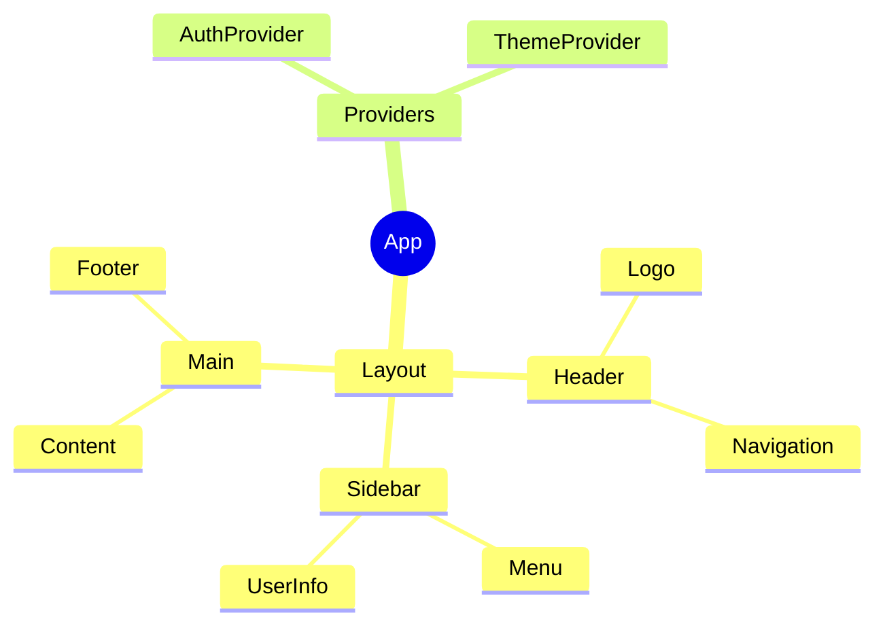
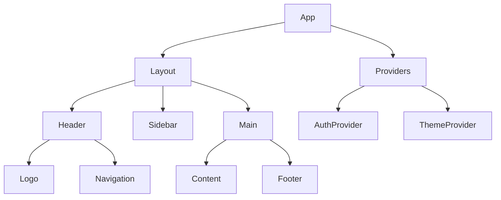
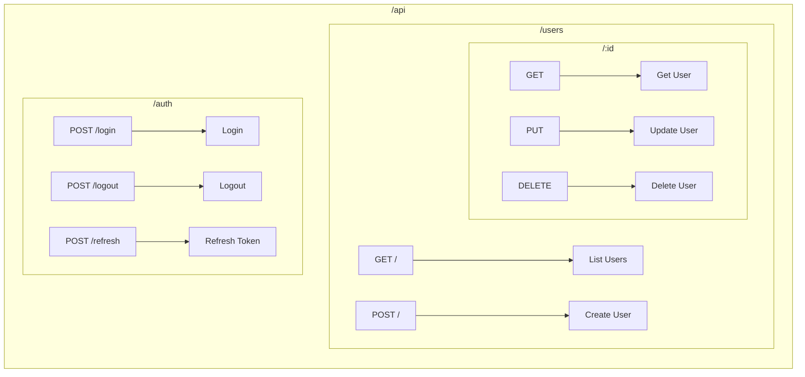
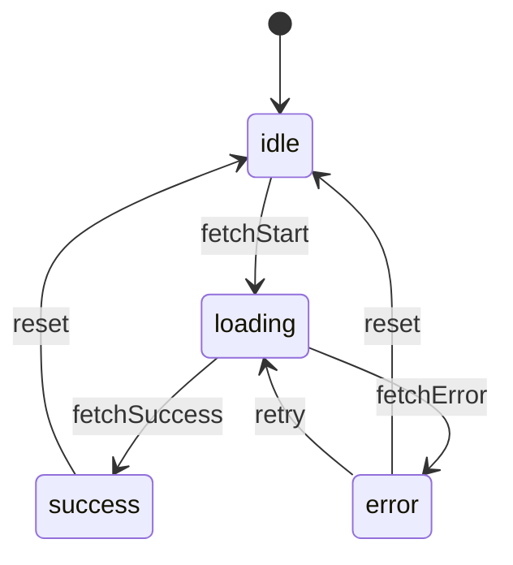
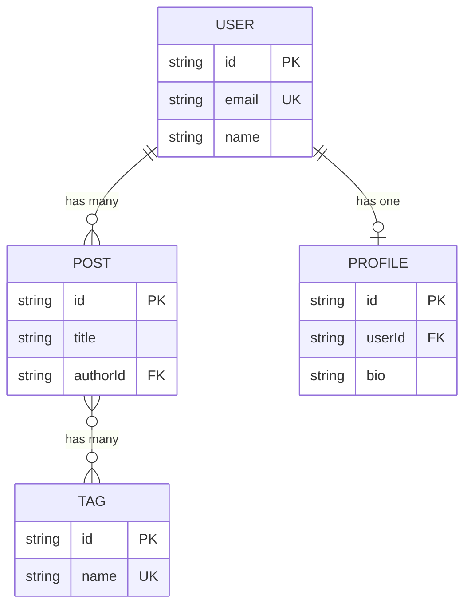
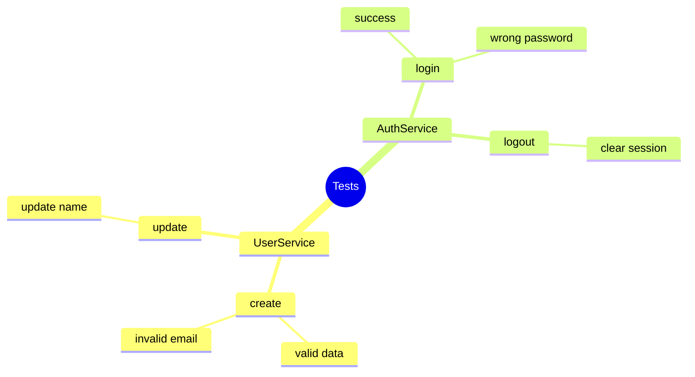
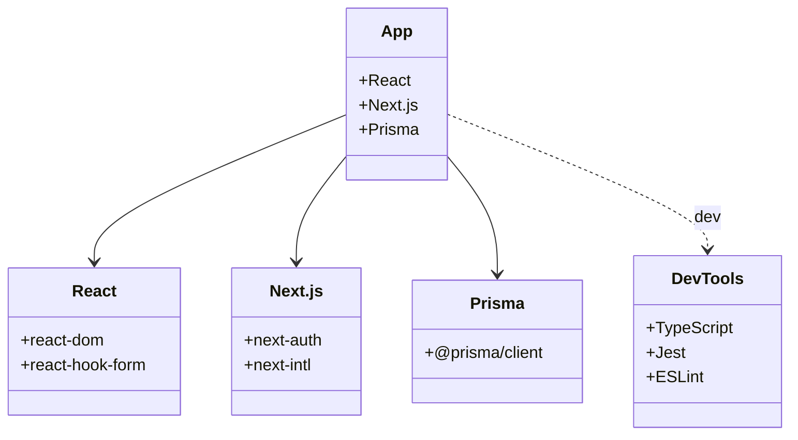
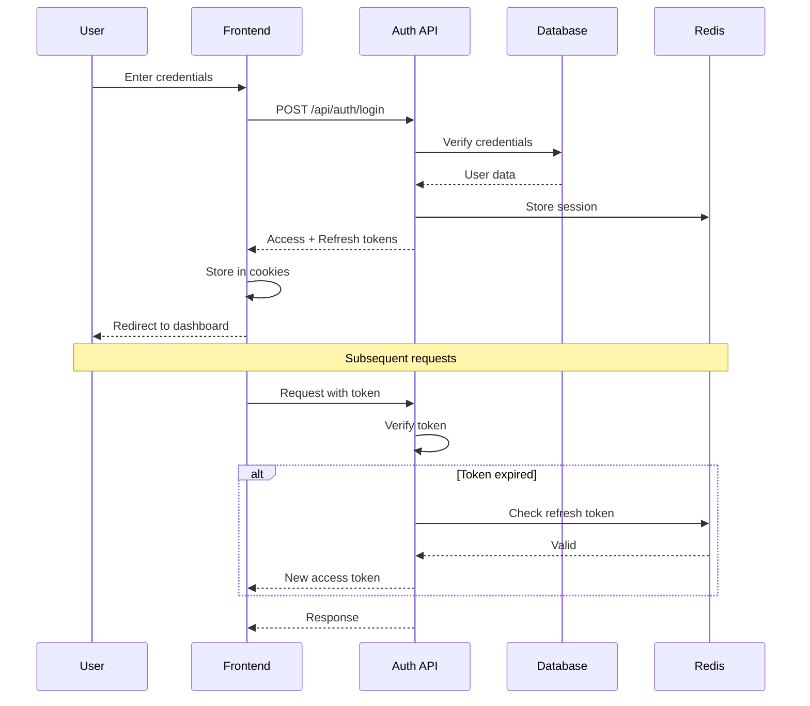
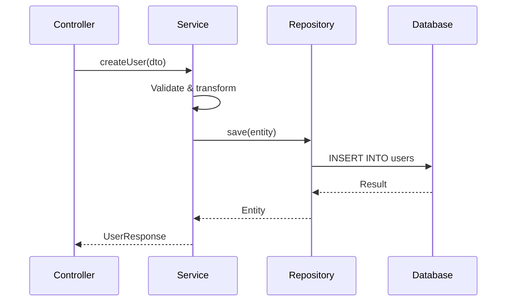

# Canvas Reverse Engineering Patterns

コードから図を自動生成するパターン集。

---

## Overview

```
┌─────────────────────────────────────────────────────────────┐
│                    SOURCE CODE                               │
│  Components, Routes, State, Schema, Tests, Dependencies     │
└─────────────────────┬───────────────────────────────────────┘
                      ↓ Pattern Matching
┌─────────────────────────────────────────────────────────────┐
│                    EXTRACTION                                │
│  Entities, Relationships, Flows, States                     │
└─────────────────────┬───────────────────────────────────────┘
                      ↓ Template Application
┌─────────────────────────────────────────────────────────────┐
│                    DIAGRAM                                   │
│  Mermaid / draw.io / ASCII                                  │
└─────────────────────────────────────────────────────────────┘
```

---

## Pattern Catalog

| # | Pattern | Target | Output | Trigger |
|---|---------|--------|--------|---------|
| 1 | Component Tree | React/Vue components | Mind Map / Flowchart | `/Canvas components` |
| 2 | API Route Map | Next.js/Express routes | Flowchart | `/Canvas api routes` |
| 3 | State Machine | Redux/Zustand/XState | State Diagram | `/Canvas state` |
| 4 | Database Schema | Prisma/TypeORM/SQL | ER Diagram | `/Canvas schema` |
| 5 | Test Structure | Jest/Vitest tests | Mind Map | `/Canvas tests` |
| 6 | Dependency Graph | package.json/imports | Class Diagram | `/Canvas deps` |
| 7 | Auth Flow | Auth handlers | Sequence Diagram | `/Canvas auth flow` |
| 8 | Data Flow | API handlers | Sequence Diagram | `/Canvas data flow` |

---

## Pattern 1: React Component Tree

### Target Files

```
src/components/**/*.tsx
src/components/**/*.jsx
src/app/**/page.tsx (Next.js App Router)
src/pages/**/*.tsx (Next.js Pages Router)
```

### Extraction Rules

```typescript
// Extract from imports
import { Button } from './Button'  // → Child component
import { useAuth } from '@/hooks'  // → Hook dependency

// Extract from JSX
<Layout>                           // → Parent-child relationship
  <Header />
  <Sidebar />
  <Main>
    <Content />
  </Main>
</Layout>
```

### Output: Mind Map



### Output: Flowchart (Hierarchy)



---

## Pattern 2: API Route Map

### Target Files (Next.js App Router)

```
src/app/api/**/route.ts
```

### Extraction Rules

```typescript
// File: src/app/api/users/[id]/route.ts
export async function GET(req, { params }) { }   // → GET /api/users/:id
export async function PUT(req, { params }) { }   // → PUT /api/users/:id
export async function DELETE(req, { params }) { } // → DELETE /api/users/:id

// File: src/app/api/auth/login/route.ts
export async function POST(req) { }              // → POST /api/auth/login
```

### Output: Flowchart



---

## Pattern 3: State Machine

### Target Files

```
src/store/**/*.ts           # Redux/Zustand
src/machines/**/*.ts        # XState
src/context/**/*.tsx        # React Context with reducers
```

### Extraction Rules (Redux Toolkit)

```typescript
// Extract from createSlice
const userSlice = createSlice({
  name: 'user',
  initialState: { status: 'idle', data: null, error: null },
  reducers: {
    fetchStart: (state) => { state.status = 'loading' },
    fetchSuccess: (state, action) => { state.status = 'success'; state.data = action.payload },
    fetchError: (state, action) => { state.status = 'error'; state.error = action.payload },
    reset: (state) => { state.status = 'idle' }
  }
})
// → States: idle, loading, success, error
// → Transitions: fetchStart, fetchSuccess, fetchError, reset
```

### Output: State Diagram



---

## Pattern 4: Database Schema

### Target Files

```
prisma/schema.prisma        # Prisma
src/entities/**/*.ts        # TypeORM
migrations/*.sql            # Raw SQL
drizzle/schema.ts           # Drizzle
```

### Extraction Rules (Prisma)

```prisma
model User {
  id        String   @id @default(cuid())
  email     String   @unique
  name      String?
  posts     Post[]                        // → 1:N relationship
  profile   Profile?                      // → 1:1 relationship
}

model Post {
  id        String   @id @default(cuid())
  title     String
  author    User     @relation(fields: [authorId], references: [id])
  authorId  String
  tags      Tag[]                         // → N:M relationship
}
```

### Output: ER Diagram



---

## Pattern 5: Test Structure

### Target Files

```
tests/**/*.test.ts
tests/**/*.spec.ts
__tests__/**/*.ts
*.test.tsx
```

### Extraction Rules

```typescript
// Extract from describe/it blocks
describe('UserService', () => {
  describe('create', () => {
    it('should create user with valid data', () => {})
    it('should throw error with invalid email', () => {})
  })
  describe('update', () => {
    it('should update user name', () => {})
  })
})
// → Hierarchy: UserService > create > [tests], update > [tests]
```

### Output: Mind Map



---

## Pattern 6: Dependency Graph

### Target Files

```
package.json
src/**/*.ts (import statements)
```

### Extraction Rules

```json
// package.json dependencies
{
  "dependencies": {
    "react": "^18.0.0",      // → Runtime dep
    "next": "^14.0.0",
    "@prisma/client": "^5.0.0"
  },
  "devDependencies": {
    "typescript": "^5.0.0",  // → Dev dep
    "jest": "^29.0.0"
  }
}
```

### Output: Class Diagram Style



---

## Pattern 7: Auth Flow

### Target Files

```
src/app/api/auth/**/*.ts
src/lib/auth.ts
src/middleware.ts
```

### Extraction Rules

```typescript
// Trace the authentication flow
// 1. Login request → validate credentials
// 2. Generate tokens → store session
// 3. Return tokens → set cookies
// 4. Subsequent requests → verify token → refresh if needed
```

### Output: Sequence Diagram



---

## Pattern 8: Data Flow

### Target Files

```
src/app/api/**/*.ts
src/services/**/*.ts
src/repositories/**/*.ts
```

### Extraction Rules

```typescript
// Trace data through layers
// Controller → Service → Repository → Database
// Response flows back through same layers
```

### Output: Sequence Diagram



---

## Auto-Detection

Canvas がコードを分析して適切なパターンを提案:

```yaml
questions:
  - question: "検出されたパターンから図を生成しますか？"
    header: "Pattern"
    options:
      - label: "Component Tree (12 components found)"
        description: "React コンポーネント階層を可視化"
      - label: "API Routes (8 endpoints found)"
        description: "API エンドポイントマップを生成"
      - label: "State Machine (3 slices found)"
        description: "状態遷移図を生成"
      - label: "All detected patterns"
        description: "すべてのパターンを生成"
    multiSelect: true
```

---

## Trigger Commands

```
/Canvas analyze                    # 自動検出して提案
/Canvas components                 # Pattern 1: Component Tree
/Canvas api routes                 # Pattern 2: API Route Map
/Canvas state                      # Pattern 3: State Machine
/Canvas schema                     # Pattern 4: Database Schema
/Canvas tests                      # Pattern 5: Test Structure
/Canvas deps                       # Pattern 6: Dependency Graph
/Canvas auth flow                  # Pattern 7: Auth Flow
/Canvas data flow [handler]        # Pattern 8: Data Flow
```
