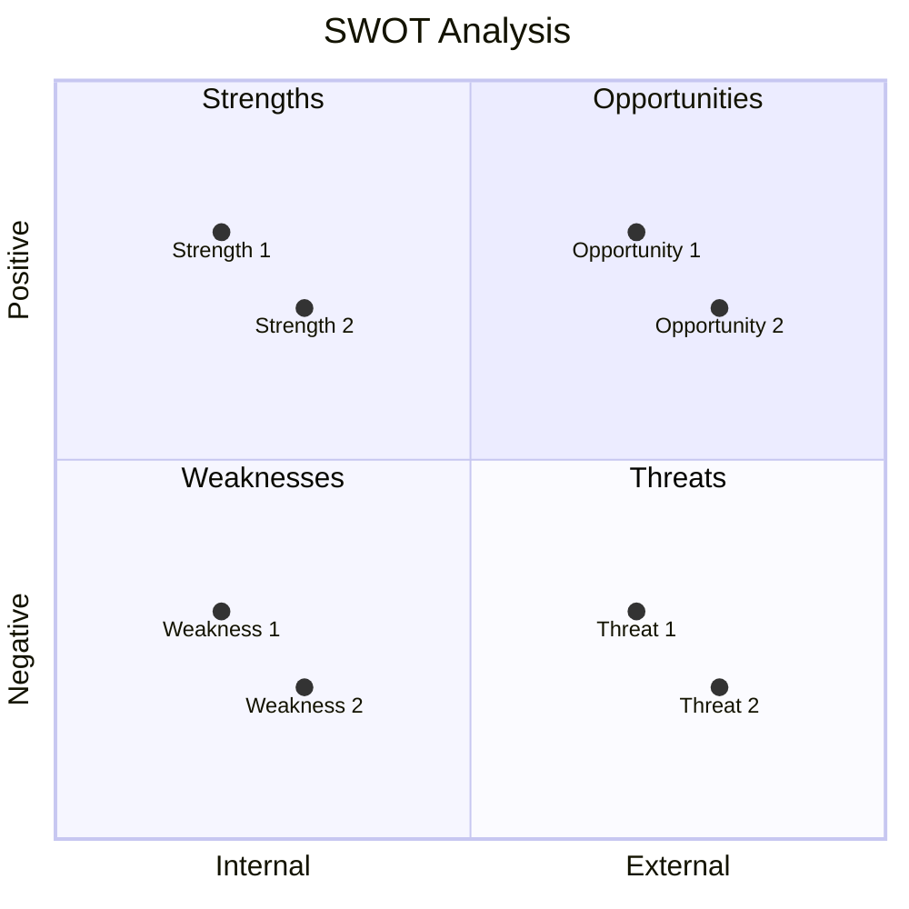
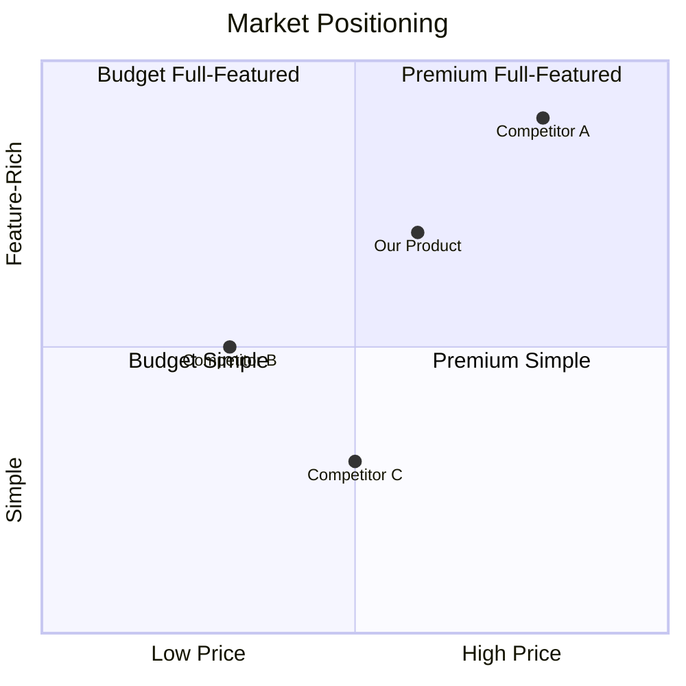

# Compete Analysis Templates Reference

Core analysis frameworks and templates for competitive intelligence.

## Competitor Profile Template

```markdown
## Competitor Profile: [Company Name]

### Overview
- **Founded:** [Year]
- **Headquarters:** [Location]
- **Company Size:** [Employees]
- **Funding:** [Total raised / Public]
- **Target Market:** [Description]

### Product Summary
[2-3 sentence description of their core offering]

### Key Strengths
1. [Strength 1] - [Evidence]
2. [Strength 2] - [Evidence]
3. [Strength 3] - [Evidence]

### Key Weaknesses
1. [Weakness 1] - [Evidence]
2. [Weakness 2] - [Evidence]
3. [Weakness 3] - [Evidence]

### Pricing
| Tier | Price | Key Features |
|------|-------|--------------|
| Free | ¥0 | [Features] |
| Pro | ¥X/month | [Features] |
| Enterprise | Custom | [Features] |

### Target Customer
- **Primary:** [Description]
- **Secondary:** [Description]
- **Not targeting:** [Description]

### Recent Moves
- [YYYY-MM] [What they did]
- [YYYY-MM] [What they did]

### Sources
- [Source 1 with link]
- [Source 2 with link]
```

## Feature Comparison Matrix

### Basic Matrix

```markdown
## Feature Comparison: [Category]

| Feature | Our Product | Competitor A | Competitor B | Competitor C |
|---------|-------------|--------------|--------------|--------------|
| **Core Features** |
| Feature 1 | Yes | Yes | Yes | No |
| Feature 2 | Planned | Yes | No | Yes |
| Feature 3 | Yes | Partial | Yes | Yes |
| **Advanced Features** |
| Feature 4 | Yes | No | No | No |
| Feature 5 | No | Yes | Yes | No |
| **Integrations** |
| Integration 1 | Yes | Yes | No | Yes |
| Integration 2 | No | Yes | Yes | No |
| **Support** |
| 24/7 Support | Yes | Yes | No | Yes |
| Documentation | Good | Excellent | Poor | Good |

### Legend
- Yes = Fully available
- No = Not available
- Partial = Limited functionality
- Planned = On roadmap
```

### Weighted Scoring Matrix

```markdown
## Detailed Feature Comparison

| Feature | Weight | Our Score | Comp A | Comp B | Comp C |
|---------|--------|-----------|--------|--------|--------|
| [Feature 1] | 5 | 4 | 5 | 3 | 4 |
| [Feature 2] | 4 | 5 | 3 | 4 | 2 |
| [Feature 3] | 3 | 3 | 4 | 5 | 3 |
| [Feature 4] | 5 | 5 | 2 | 3 | 4 |
| **Weighted Total** | - | **85** | **72** | **68** | **65** |

### Scoring Guide
5 = Best in class
4 = Above average
3 = Average
2 = Below average
1 = Poor/Missing
```

## SWOT Analysis Template

```markdown
## SWOT Analysis: [Our Product]

### Strengths (Internal, Positive)
| Strength | Evidence | How to Leverage |
|----------|----------|-----------------|
| [Strength 1] | [Data/Examples] | [Action] |
| [Strength 2] | [Data/Examples] | [Action] |
| [Strength 3] | [Data/Examples] | [Action] |

### Weaknesses (Internal, Negative)
| Weakness | Impact | Mitigation Plan |
|----------|--------|-----------------|
| [Weakness 1] | [Impact level] | [How to address] |
| [Weakness 2] | [Impact level] | [How to address] |

### Opportunities (External, Positive)
| Opportunity | Potential | Required Action |
|-------------|-----------|-----------------|
| [Opportunity 1] | [High/Med/Low] | [What to do] |
| [Opportunity 2] | [High/Med/Low] | [What to do] |

### Threats (External, Negative)
| Threat | Likelihood | Response Strategy |
|--------|------------|-------------------|
| [Threat 1] | [High/Med/Low] | [How to respond] |
| [Threat 2] | [High/Med/Low] | [How to respond] |
```

### SWOT Mermaid Visualization



## Positioning Map

### 2x2 Positioning Matrix



### Positioning Statement Template

```markdown
## Positioning Statement

**For** [target customer]
**Who** [has this need/problem]
**[Product Name]** is a [category]
**That** [key benefit]
**Unlike** [primary competitor]
**Our product** [key differentiator]

### Example
For small business owners
Who struggle to manage customer relationships
CRM Lite is a customer management platform
That makes customer tracking effortless in under 5 minutes
Unlike Salesforce
Our product requires no training and costs 80% less
```

## Benchmarking Framework

### Performance Benchmarking

```markdown
## Performance Benchmark: [Category]

| Metric | Our Product | Industry Average | Best in Class | Gap |
|--------|-------------|------------------|---------------|-----|
| Load Time | 2.5s | 3.0s | 1.5s | -1.0s |
| Uptime | 99.5% | 99.0% | 99.99% | -0.49% |
| Response Time | 200ms | 300ms | 100ms | -100ms |
| Error Rate | 0.5% | 1.0% | 0.1% | -0.4% |

### Action Items
1. [What to improve to close the gap]
2. [What to improve to close the gap]
```

### Experience Benchmarking

```markdown
## UX Benchmark: [Flow]

| Criterion | Our Product | Competitor A | Competitor B | Notes |
|-----------|-------------|--------------|--------------|-------|
| Steps to Complete | 5 | 3 | 7 | Comp A is most efficient |
| Time to Complete | 2min | 1min | 4min | We're middle of pack |
| Error Recovery | Good | Poor | Excellent | Opportunity vs Comp A |
| Mobile Experience | Excellent | Good | Poor | Our strength |

### Insights
1. [What we learned]
2. [What we should do]
```

## Differentiation Strategies

| Strategy | When to Use | Example |
|----------|-------------|---------|
| **Feature Differentiation** | You can build unique capabilities | Notion's blocks |
| **Price Differentiation** | Cost structure advantage | Canva vs Adobe |
| **Experience Differentiation** | Better UX is achievable | Linear vs Jira |
| **Niche Focus** | Underserved segment exists | Figma for designers |
| **Integration Ecosystem** | Partners amplify value | Zapier |
| **Speed/Performance** | Performance is critical | Algolia search |
| **Trust/Security** | Compliance matters | 1Password |

### Differentiation Strategy Document

```markdown
## Differentiation Strategy: [Product Name]

### Our Chosen Strategy
**[Primary Strategy]:** [One sentence description]

### Why This Strategy
1. [Reason 1 with evidence]
2. [Reason 2 with evidence]
3. [Reason 3 with evidence]

### How We Execute
| Element | Current State | Target State | Action |
|---------|---------------|--------------|--------|
| Feature | [Current] | [Target] | [What to build] |
| Messaging | [Current] | [Target] | [How to communicate] |
| Pricing | [Current] | [Target] | [How to adjust] |

### Validation
- [ ] Customer interviews confirm need
- [ ] Competitive gap analysis supports opportunity
- [ ] Technical feasibility assessed
- [ ] Business model supports strategy

### Risks
1. [Risk 1] - Mitigation: [How to address]
2. [Risk 2] - Mitigation: [How to address]
```

## Market Trends Template

```markdown
## Market Trends Analysis: [Industry/Category]

### Industry Shifts
| Trend | Impact | Our Position | Competitor Position | Action |
|-------|--------|--------------|---------------------|--------|
| [Trend 1] | High/Med/Low | Ahead/Par/Behind | [Comp positions] | [Action] |
| [Trend 2] | High/Med/Low | Ahead/Par/Behind | [Comp positions] | [Action] |

### Technology Trends
| Technology | Adoption Stage | Competitors Using | Our Status | Priority |
|------------|----------------|-------------------|------------|----------|
| [Tech 1] | Early/Growth/Mature | [List] | [Using/Evaluating/Not] | [H/M/L] |

### Regulatory Changes
| Regulation | Effective Date | Impact | Our Readiness | Competitor Readiness |
|------------|----------------|--------|---------------|----------------------|
| [Reg 1] | [Date] | [Impact] | [Ready/Partial/Not] | [Status] |

### Customer Behavior Shifts
| Shift | Evidence | Implication | Action |
|-------|----------|-------------|--------|
| [Behavior 1] | [Data/Source] | [What it means] | [What to do] |

### Market Size & Growth
| Metric | Current | Projected (3Y) | Source |
|--------|---------|----------------|--------|
| TAM | ¥[X]B | ¥[Y]B | [Source] |
| SAM | ¥[X]B | ¥[Y]B | [Source] |
| SOM | ¥[X]M | ¥[Y]M | [Internal] |
| CAGR | [X%] | [Y%] | [Source] |

### Emerging Players
| Company | Founded | Funding | Threat Level | Watch Reason |
|---------|---------|---------|--------------|--------------|
| [Startup 1] | [Year] | ¥[X]M | High/Med/Low | [Why watch] |
```
