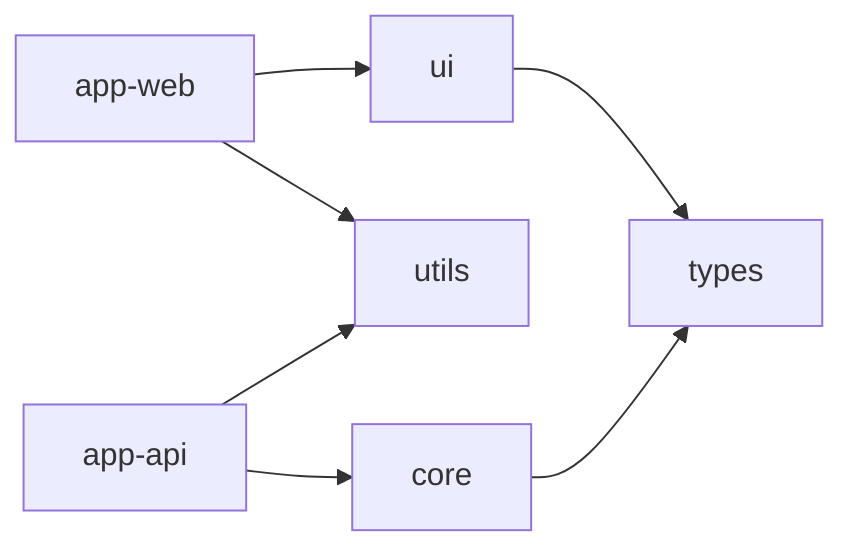

# Monorepo Health Check & Proposals

Health check mechanisms, diagnostic commands, and improvement proposal framework specific to monorepos.

---

## Monorepo Health Score

In addition to the standard Health Score (AP-001 through AP-010), monorepo-specific evaluation axes are applied.

### Scoring Matrix

| Category | Weight | Criteria |
|----------|--------|----------|
| Package Boundaries | 25% | No boundary violations, clear public API, internal protection |
| Dependency Health | 25% | No cycles, no implicit deps, version consistency |
| Config Consistency | 20% | Shared base config, no drift |
| Build Efficiency | 15% | Cache utilization, affected-only builds, parallelization |
| Package Hygiene | 15% | No orphan packages, no root pollution |

### Grade Scale

| Score | Grade | Action |
|-------|-------|--------|
| 90-100 | A | Healthy monorepo. Continue regular monitoring |
| 75-89 | B | Minor issues. Address in next sprint |
| 60-74 | C | Structural issues. Prioritize fixes |
| 40-59 | D | Severe degradation. Create improvement plan immediately |
| <40 | F | Monorepo benefits not realized. Fundamental review needed |

---

## Health Check Commands

### JS/TS (Turborepo)

```bash
# 1. Visualize dependency graph
npx turbo run build --dry-run --graph

# 2. Detect circular dependencies
npx madge --circular --extensions ts packages/

# 3. Detect undeclared dependencies (per package)
for pkg in packages/*/; do
  echo "=== $(basename $pkg) ==="
  npx depcheck "$pkg" --ignores="@types/*"
done

# 4. Detect version mismatches
npx syncpack list-mismatches

# 5. Detect unused packages
npx turbo run build --dry-run 2>&1 | grep "No tasks"

# 6. Build cache hit rate
npx turbo run build --summarize
```

### JS/TS (Nx)

```bash
# 1. Dependency graph (browser)
npx nx graph

# 2. Affected analysis
npx nx affected --target=build --base=main

# 3. Module boundary rule violations
npx nx lint --all

# 4. Project dependencies (JSON)
npx nx graph --file=output.json

# 5. Detect circular dependencies
npx nx graph --file=dep-graph.json
# Parse dep-graph.json to detect cycles
```

### Python (uv)

```bash
# 1. List workspace members
uv workspace list

# 2. Dependency consistency check
uv lock --check

# 3. Detect unused dependencies (per package)
for pkg in packages/*/; do
  echo "=== $(basename $pkg) ==="
  cd "$pkg" && pip-audit 2>/dev/null || echo "pip-audit not installed"
  cd -
done

# 4. Visualize import graph
pipdeptree --graph-output png > deps.png
```

### Python (Pants)

```bash
# 1. Dependency graph
pants dependencies --transitive src/python/core::

# 2. Detect unused dependencies
pants lint src/python/::

# 3. Affected analysis
pants --changed-since=main dependees --transitive

# 4. Circular dependencies
pants paths --from=src/python/core --to=src/python/api
```

### Go (Workspace)

```bash
# 1. Check workspace members
cat go.work

# 2. Dependencies per module
for mod in services/*/; do
  echo "=== $(basename $mod) ==="
  cd "$mod" && go mod graph | head -20
  cd -
done

# 3. Detect circular dependencies
go vet ./...

# 4. Unused dependencies
for mod in services/*/; do
  cd "$mod" && go mod tidy -diff
  cd -
done
```

### Java/Kotlin (Gradle)

```bash
# 1. Project structure
./gradlew projects

# 2. Dependency tree
./gradlew dependencies --configuration compileClasspath

# 3. Inter-module dependencies
./gradlew dependencyInsight --dependency :core --configuration compileClasspath

# 4. Detect unused dependencies
./gradlew buildHealth  # requires dependency-analysis plugin
```

### Java/Kotlin (Maven)

```bash
# 1. Module structure
mvn help:effective-pom | grep "<module>"

# 2. Dependency tree
mvn dependency:tree

# 3. Detect unused dependencies
mvn dependency:analyze

# 4. Circular dependencies
mvn validate -pl :module-a -am  # verify via reactor order
```

### Rust (Cargo Workspace)

```bash
# 1. Workspace members
cargo metadata --format-version 1 | jq '.workspace_members'

# 2. Dependency graph
cargo tree --workspace

# 3. Unused dependencies
cargo +nightly udeps --workspace

# 4. Circular dependencies (auto-detected at build time)
cargo check --workspace
```

---

## Automated Health Check Procedure

Standard procedure when Grove audits a monorepo.

### Step 1: Monorepo Type Detection

```yaml
DETECTION_RULES:
  - file: "turbo.json"
    type: "turborepo"
    workspace_file: "pnpm-workspace.yaml | package.json.workspaces"
  - file: "nx.json"
    type: "nx"
    workspace_file: "nx.json"
  - file: "lerna.json"
    type: "lerna"
    workspace_file: "lerna.json"
  - file: "go.work"
    type: "go-workspace"
    workspace_file: "go.work"
  - file: "pyproject.toml"
    match: "[tool.uv.workspace]"
    type: "uv"
    workspace_file: "pyproject.toml"
  - file: "pants.toml"
    type: "pants"
    workspace_file: "pants.toml"
  - file: "WORKSPACE"
    type: "bazel"
    workspace_file: "WORKSPACE"
  - file: "settings.gradle.kts"
    match: "include("
    type: "gradle"
    workspace_file: "settings.gradle.kts"
  - file: "pom.xml"
    match: "<modules>"
    type: "maven"
    workspace_file: "pom.xml"
  - file: "Cargo.toml"
    match: "[workspace]"
    type: "cargo"
    workspace_file: "Cargo.toml"
```

### Step 2: Package Inventory

Collect the following for each package:

```yaml
PACKAGE_INVENTORY:
  - name: "{package-name}"
    path: "{relative-path}"
    type: "app | library | tool | config"
    dependencies:
      internal: ["pkg-a", "pkg-b"]       # Dependencies within monorepo
      external: ["react", "express"]      # External dependencies
    dependents: ["app-web", "app-api"]    # Packages that depend on this one
    has_tests: true | false
    has_readme: true | false
    config_files: ["tsconfig.json", ".eslintrc"]
    last_modified: "YYYY-MM-DD"
```

### Step 3: Anti-Pattern Scan

Apply AP-011 through AP-016 in addition to standard AP-001 through AP-010:

```yaml
MONOREPO_SCAN_CHECKLIST:
  - id: "AP-011"
    check: "Circular Package Dependencies"
    method: "Detect cycles in dependency graph"
    severity: "Critical"

  - id: "AP-012"
    check: "Package Boundary Violation"
    method: "Import paths directly reference another package's src/internal/"
    severity: "High"

  - id: "AP-013"
    check: "Shared Config Drift"
    method: "Compare config files across packages (target, strict, rules)"
    severity: "Medium"

  - id: "AP-014"
    check: "Root Pollution"
    method: "src/ or *.ts/py/go files exist at monorepo root"
    severity: "Medium"

  - id: "AP-015"
    check: "Orphan Package"
    method: "Nodes with in-degree=0 and not deployable in dependency graph"
    severity: "Low"

  - id: "AP-016"
    check: "Implicit Dependency"
    method: "Imported but undeclared in package.json/go.mod"
    severity: "High"
```

### Step 4: Score Calculation

```
MONOREPO_HEALTH =
    Package_Boundaries(25%)
  + Dependency_Health(25%)
  + Config_Consistency(20%)
  + Build_Efficiency(15%)
  + Package_Hygiene(15%)

Deduction rules per category:

Package_Boundaries (25pt):
  - AP-012 detected: -10pt per violation
  - Public API (index.ts/mod.rs) undefined: -5pt per package

Dependency_Health (25pt):
  - AP-011 detected: -15pt per cycle
  - AP-016 detected: -8pt per implicit dep
  - Version mismatch: -3pt per mismatch

Config_Consistency (20pt):
  - AP-013 detected: -5pt per drift
  - No shared base config: -10pt

Build_Efficiency (15pt):
  - Cache not configured: -8pt
  - Full build for all packages (no affected-only builds): -5pt
  - Parallel build not configured: -3pt

Package_Hygiene (15pt):
  - AP-014 detected: -5pt
  - AP-015 detected: -3pt per orphan
  - Missing README.md: -2pt per package
```

---

## Improvement Proposals

Grove auto-generates improvement proposals based on health check results.

### Proposal Template

```markdown
## Monorepo Improvement Proposal

**Repository:** {name}
**Current Score:** {score}/100 (Grade: {grade})
**Target Score:** {target}/100
**Estimated Effort:** {effort}

### Detected Issues (Priority Order)

| # | Issue | Anti-Pattern | Severity | Fix Effort |
|---|-------|-------------|----------|------------|
| 1 | {description} | AP-{XXX} | {sev} | {effort} |

### Recommended Actions

#### Phase 1: Quick Wins ({effort})
- [ ] {action 1}
- [ ] {action 2}

#### Phase 2: Structural Improvements ({effort})
- [ ] {action 3}
- [ ] {action 4}

#### Phase 3: Optimization ({effort})
- [ ] {action 5}

### Expected Impact
- Score: {before} → {after}
- Build time: {before} → {after}
- Developer experience: {improvement}
```

### Common Proposals by Issue

#### PROPOSAL: Shared Config Package

**Trigger:** AP-013 (Config Drift) detected
**Applies to:** JS/TS monorepo (Turborepo/Nx)

```
Proposal:
1. Create packages/config/ package
2. Consolidate tsconfig.base.json, eslint.base.js
3. Change each package's config to use extends
4. Add config drift detection to CI

Expected effect:
- Config changes only need to be made in one place
- New packages automatically inherit unified settings
```

#### PROPOSAL: Dependency Boundary Enforcement

**Trigger:** AP-012 (Boundary Violation) detected
**Applies to:** All monorepo types

```
Proposal:
1. [JS/TS] Add @nx/enforce-module-boundaries ESLint rule
2. [JS/TS] Restrict public API via package.json exports field
3. [Go] Apply internal/ package structure
4. [Rust] Restrict visibility with pub(crate)
5. Add import path validation to CI

Expected effect:
- Invalid internal references become build errors
- Package independence is guaranteed
```

#### PROPOSAL: Circular Dependency Resolution

**Trigger:** AP-011 (Circular Dependencies) detected

```
Proposal:
1. Identify circular import points (specific imports between A and B)
2. Extract common interfaces to shared package
3. Fix dependency direction to be unidirectional
4. Update dependency diagram

Resolution patterns:
  Pattern A: Interface Extraction
    Before: auth → user → auth (cycle)
    After:  auth → shared ← user (extract interface to shared)

  Pattern B: Event-Based Decoupling
    Before: order → inventory → order (cycle)
    After:  order → event-bus ← inventory (indirect communication via events)

  Pattern C: Dependency Inversion
    Before: api → database → api (cycle)
    After:  api → repository-interface ← database (invert via DI)
```

#### PROPOSAL: Orphan Package Cleanup

**Trigger:** AP-015 (Orphan Package) detected

```
Proposal:
1. List orphan packages from dependency graph
2. Check last modified date for each package
3. Classify:
   - ARCHIVE: No updates for 6+ months → propose archival
   - EXPERIMENTAL: README has experimental status → propose labeling
   - INTEGRATE: Can be merged into another package → propose merge
   - DELETE: Completely unnecessary → propose deletion (delegate to Sweep)
```

#### PROPOSAL: Build Optimization

**Trigger:** Build Efficiency score is low

```
Proposal:
1. [Turborepo] Add cache settings to turbo.json
   - Explicit outputs and inputs definitions
   - Remote cache (Vercel) configuration
2. [Nx] Configure affected-only builds
   - nx affected --target=build
3. [Gradle] Enable build cache
   - org.gradle.caching=true
4. Configure CI pipeline parallelization

Expected effect:
- 70-90% build time reduction on cache hit
- CI time per PR limited to affected packages only
```

---

## Monorepo Migration Proposals

Proposals for converting to monorepo or migrating between monorepo tools.

### Polyrepo → Monorepo Migration

```yaml
MIGRATION_ASSESSMENT:
  prerequisites:
    - Common dependencies duplicated across 3+ repositories
    - Frequent coordinated changes across repositories
    - Team works across multiple repositories

  recommended_tool:
    js_ts: "Turborepo (pnpm workspace)"
    python: "uv workspace"
    go: "Go workspace (go.work)"
    jvm: "Gradle multi-module"
    rust: "Cargo workspace"
    multi_language: "Pants or Bazel"

  migration_steps:
    1: "Create new monorepo repository"
    2: "Copy each repository to packages/ (or apps/)"
    3: "Create workspace configuration file"
    4: "Change internal dependencies to workspace protocol"
    5: "Create shared config package"
    6: "Integrate CI pipelines"
    7: "Archive old repositories"

  risks:
    - Git history consolidation is complex (git subtree/filter-repo)
    - CI/CD pipeline redesign required
    - Permission management changes (control via CODEOWNERS)
```

### Monorepo Tool Migration

#### Lerna → Turborepo

```yaml
MIGRATION_STEPS:
  1:
    action: "Create pnpm-workspace.yaml"
    detail: "Port packages array from lerna.json"
  2:
    action: "Create turbo.json"
    detail: "Pipeline configuration (build, test, lint)"
  3:
    action: "Update package.json scripts"
    detail: "Change lerna run → turbo run"
  4:
    action: "Delete lerna.json"
    detail: "Also remove related devDependencies (lerna)"
  5:
    action: "Update CI configuration"
    detail: "Leverage turbo --filter, --cache"

  effort: "2-4 hours"
  risk: "Low (build pipeline changes only)"
```

#### Nx → Turborepo (or vice versa)

```yaml
COMPARISON:
  nx:
    strengths:
      - Powerful dependency graph
      - module-boundaries ESLint rule
      - Code generation (generators)
      - Plugin ecosystem
    best_for: "Large teams, strict architecture management"

  turborepo:
    strengths:
      - Simple configuration
      - pnpm/npm/yarn native
      - Remote cache (Vercel)
      - Low learning curve
    best_for: "Small-medium teams, simple pipelines"

  migration_effort: "High (1-2 weeks)"
  recommendation: "Do not recommend tool migration unless there is a clear reason"
```

---

## Health Check Report Template

```markdown
## Monorepo Health Report

**Repository:** {name}
**Type:** {Turborepo | Nx | Go Workspace | uv | Gradle | ...}
**Packages:** {count} ({apps} apps, {libs} libraries, {tools} tools)
**Date:** YYYY-MM-DD

### Overall Score: {score}/100 (Grade: {grade})

### Score Breakdown

| Category | Score | Max | Issues |
|----------|-------|-----|--------|
| Package Boundaries | {n} | 25 | {summary} |
| Dependency Health | {n} | 25 | {summary} |
| Config Consistency | {n} | 20 | {summary} |
| Build Efficiency | {n} | 15 | {summary} |
| Package Hygiene | {n} | 15 | {summary} |

### Anti-Patterns Detected

| ID | Pattern | Severity | Location | Impact |
|----|---------|----------|----------|--------|
| AP-{XXX} | {name} | {sev} | {location} | {impact} |

### Package Dependency Graph



### Improvement Proposals

1. **[P0]** {proposal} — Effort: {effort}
2. **[P1]** {proposal} — Effort: {effort}
3. **[P2]** {proposal} — Effort: {effort}

### Recommended Next Steps

- [ ] {action 1} (→ {agent handoff})
- [ ] {action 2} (→ {agent handoff})
```

---

## New Package Scaffold Template

Templates for adding new packages to a monorepo.

### JS/TS Package

```
packages/{name}/
├── src/
│   └── index.ts            # Public API (barrel export)
├── tests/
│   └── index.test.ts
├── package.json             # name: "@{scope}/{name}"
├── tsconfig.json            # extends: "@{scope}/config/tsconfig.base.json"
└── README.md                # Package description, usage, API
```

### Python Package

```
packages/{name}/
├── src/
│   └── {name}/
│       ├── __init__.py      # Public API (__all__)
│       └── core.py
├── tests/
│   ├── conftest.py
│   └── test_core.py
├── pyproject.toml           # workspace member
└── README.md
```

### Go Module

```
services/{name}/
├── cmd/
│   └── {name}/
│       └── main.go          # Entry point (if deployable)
├── internal/
│   └── handler.go
├── {name}.go                # Public API
├── {name}_test.go
├── go.mod                   # module: example.com/services/{name}
└── README.md
```

### JVM Module

```
{name}/
├── src/
│   ├── main/
│   │   ├── kotlin/          # or java/
│   │   │   └── com/example/{name}/
│   │   └── resources/
│   └── test/
│       └── kotlin/
│           └── com/example/{name}/
├── build.gradle.kts         # plugins from buildSrc conventions
└── README.md
```
