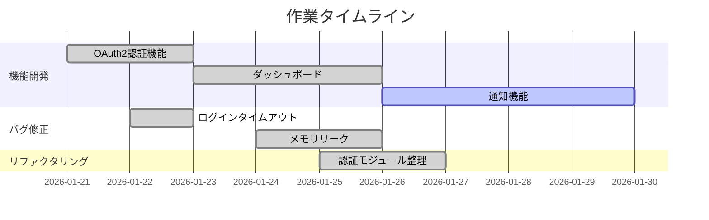
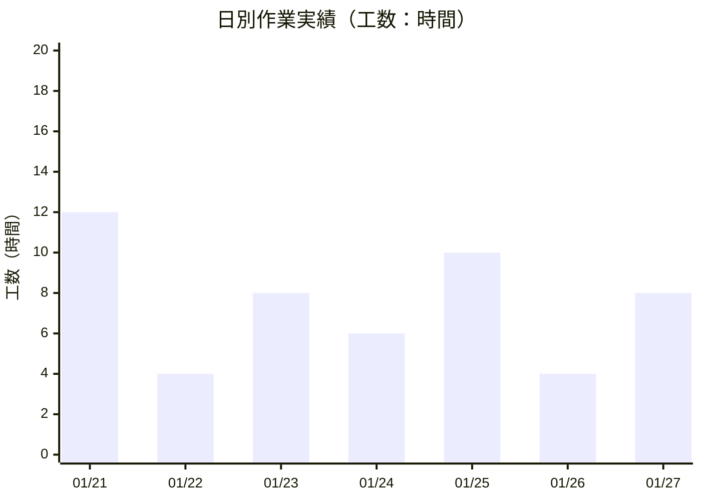
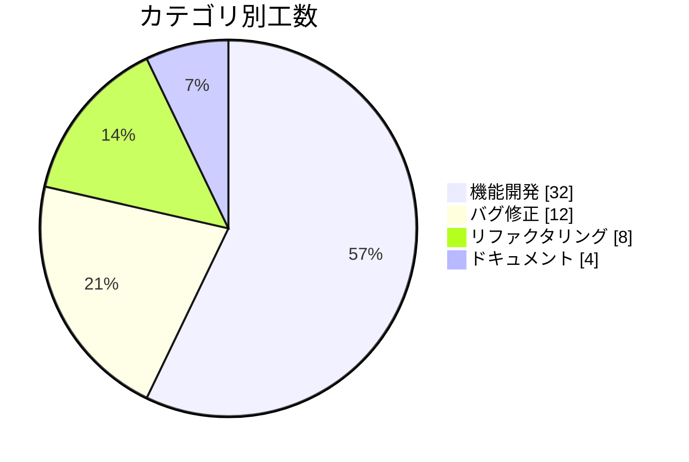

# Client Report Templates

クライアント報告用のレポートテンプレート。工数、タイムライン、グラフを含む美しいフォーマット。

---

## Work Hours Calculation

### 工数算出ロジック

PRの工数は以下の指標から推定:

| 指標 | 計算方法 | 係数 |
|------|----------|------|
| コード行数 | (additions + deletions) | 100行 = 1時間 |
| 複雑度補正 | ファイル数 × 0.25時間 | - |
| レビュー時間 | 作成〜マージの実時間の20% | - |

```typescript
function estimateHours(pr: PR): number {
  const codeHours = (pr.additions + pr.deletions) / 100;
  const complexityHours = pr.changedFiles * 0.25;
  const reviewHours = getBusinessHours(pr.createdAt, pr.mergedAt) * 0.2;

  return Math.max(0.5, Math.round((codeHours + complexityHours + reviewHours) * 2) / 2);
}
```

### 工数カテゴリ

| カテゴリ | 工数目安 | PR規模 |
|----------|----------|--------|
| 軽微 | 0.5 - 2h | XS, S |
| 標準 | 2 - 8h | M |
| 大規模 | 8 - 24h | L |
| 特大 | 24h+ | XL |

---

## Client Report Template

```markdown
# 作業報告書

━━━━━━━━━━━━━━━━━━━━━━━━━━━━━━━━━━━━━━━━━━━━━━━━━━━━━━━━━━━

**プロジェクト:** {project_name}
**報告期間:** {start_date} 〜 {end_date}
**報告日:** {report_date}
**担当者:** {author_name}

━━━━━━━━━━━━━━━━━━━━━━━━━━━━━━━━━━━━━━━━━━━━━━━━━━━━━━━━━━━

## 📊 サマリー

┌─────────────────────────────────────────────────────────────┐
│                                                             │
│   完了タスク        {completed_count} 件                     │
│   総工数           {total_hours} 時間                        │
│   コード変更        +{additions} / -{deletions} 行           │
│                                                             │
└─────────────────────────────────────────────────────────────┘

---

## 📅 作業タイムライン

{timeline_gantt_chart}

---

## 📈 日別作業実績

{daily_activity_chart}

---

## 🗂️ カテゴリ別工数

{category_breakdown_chart}

---

## 📋 作業詳細

{work_items_table}

---

## 📊 進捗サマリー

{progress_summary}

━━━━━━━━━━━━━━━━━━━━━━━━━━━━━━━━━━━━━━━━━━━━━━━━━━━━━━━━━━━

以上
```

---

## Chart Templates

### 1. Gantt Chart (Mermaid)

タイムライン表示用のガントチャート:



### 2. XY Chart - Daily Activity (Mermaid)

日別作業量のグラフ:



### 3. Pie Chart - Category Distribution (Mermaid)

カテゴリ別工数の円グラフ:



### 4. ASCII Timeline

Mermaidが使えない環境用のASCIIタイムライン:

```
作業タイムライン
================================================================================

    01/21   01/22   01/23   01/24   01/25   01/26   01/27
      │       │       │       │       │       │       │
──────┼───────┼───────┼───────┼───────┼───────┼───────┼──────
      │       │       │       │       │       │       │
feat  ████████████████████████████████████████░░░░░░░░  OAuth2, Dashboard
      │       │       │       │       │       │       │
fix   ░░░░░░░░████████████████░░░░░░░░░░░░░░░░░░░░░░░░  Login, Memory
      │       │       │       │       │       │       │
ref   ░░░░░░░░░░░░░░░░░░░░░░░░████████████████░░░░░░░░  Auth module
      │       │       │       │       │       │       │
──────┴───────┴───────┴───────┴───────┴───────┴───────┴──────

████ = 作業期間    ░░░░ = 待機/レビュー
```

### 5. ASCII Bar Chart - Daily Hours

```
日別作業工数
================================================================================

01/21  ████████████████████████  12.0h  ▲ ピーク
01/22  ████████                   4.0h
01/23  ████████████████           8.0h
01/24  ████████████               6.0h
01/25  ████████████████████      10.0h
01/26  ████████                   4.0h
01/27  ████████████████           8.0h
       ├────────┼────────┼────────┼────────┤
       0        5        10       15       20 (時間)

合計: 52.0h
```

### 6. Progress Bar

```
進捗状況
================================================================================

機能開発    [████████████████████████████████████████████░░░░] 90%  (9/10)
バグ修正    [████████████████████████████████████████████████] 100% (5/5)
リファクタ  [████████████████████████████░░░░░░░░░░░░░░░░░░░░] 60%  (3/5)
ドキュメント [████████████████░░░░░░░░░░░░░░░░░░░░░░░░░░░░░░░░] 33%  (1/3)
```

---

## Work Items Table Format

### 詳細テーブル（工数付き）

```markdown
### 📋 作業詳細

| No. | タスク | カテゴリ | 工数 | 期間 | ステータス |
|:---:|--------|:--------:|-----:|------|:----------:|
| 1 | OAuth2認証機能の実装 | 🚀 feat | 16.0h | 01/21-01/22 | ✅ 完了 |
| 2 | ダッシュボードウィジェット | 🚀 feat | 12.0h | 01/23-01/25 | ✅ 完了 |
| 3 | ログインタイムアウト修正 | 🐛 fix | 2.0h | 01/22 | ✅ 完了 |
| 4 | メモリリーク対応 | 🐛 fix | 4.0h | 01/24-01/25 | ✅ 完了 |
| 5 | 認証モジュールリファクタ | 🔧 refactor | 8.0h | 01/25-01/26 | ✅ 完了 |
| 6 | 通知機能の実装 | 🚀 feat | 10.0h | 01/26-01/29 | 🔄 進行中 |

**合計工数: 52.0h**
```

### カテゴリアイコン

| カテゴリ | アイコン | 説明 |
|----------|----------|------|
| feat | 🚀 | 新機能開発 |
| fix | 🐛 | バグ修正 |
| refactor | 🔧 | リファクタリング |
| docs | 📝 | ドキュメント |
| test | 🧪 | テスト |
| perf | ⚡ | パフォーマンス改善 |
| chore | 📦 | メンテナンス |

### ステータスアイコン

| ステータス | アイコン |
|------------|----------|
| 完了 | ✅ |
| 進行中 | 🔄 |
| レビュー中 | 👀 |
| 保留 | ⏸️ |
| 未着手 | ⬜ |

---

## Summary Box Styles

### Style 1: Bordered Box

```
┌─────────────────────────────────────────────────────────────┐
│                     📊 期間サマリー                          │
├─────────────────────────────────────────────────────────────┤
│                                                             │
│   📝 完了タスク        12 件                                 │
│   ⏱️  総工数           52.0 時間                             │
│   📈 コード変更        +8,141 / -748 行                      │
│   👤 担当者            @simota                              │
│                                                             │
└─────────────────────────────────────────────────────────────┘
```

### Style 2: Clean Metrics

```
━━━━━━━━━━━━━━━━━━━━━━━━━━━━━━━━━━━━━━━━━━━━━━

  完了タスク       12 件
  総工数          52.0 時間
  稼働日数          7 日
  1日平均工数      7.4 時間

━━━━━━━━━━━━━━━━━━━━━━━━━━━━━━━━━━━━━━━━━━━━━━
```

### Style 3: Card Style

```
╔═══════════════════════════════════════════════════════════════╗
║                                                               ║
║    ┌──────────┐  ┌──────────┐  ┌──────────┐  ┌──────────┐   ║
║    │    12    │  │   52.0   │  │  +8,141  │  │   100%   │   ║
║    │  タスク   │  │   時間   │  │   行追加  │  │  完了率  │   ║
║    └──────────┘  └──────────┘  └──────────┘  └──────────┘   ║
║                                                               ║
╚═══════════════════════════════════════════════════════════════╝
```

---

## Full Client Report Example

完全なクライアント報告書のサンプルは `samples/client-report-*.md` を参照。

### 生成コマンド例

```bash
# 週次報告
/Harvest --format client --period week --author @username

# 月次報告
/Harvest --format client --period month --project "Project Name"

# カスタム期間
/Harvest --format client --from 2026-01-01 --to 2026-01-31
```

---

## Localization

| English | Japanese |
|---------|----------|
| Work Report | 作業報告書 |
| Summary | サマリー |
| Timeline | タイムライン |
| Daily Activity | 日別作業実績 |
| Work Hours | 工数 |
| Completed Tasks | 完了タスク |
| Total Hours | 総工数 |
| Category | カテゴリ |
| Status | ステータス |
| In Progress | 進行中 |
| Completed | 完了 |
| Under Review | レビュー中 |
