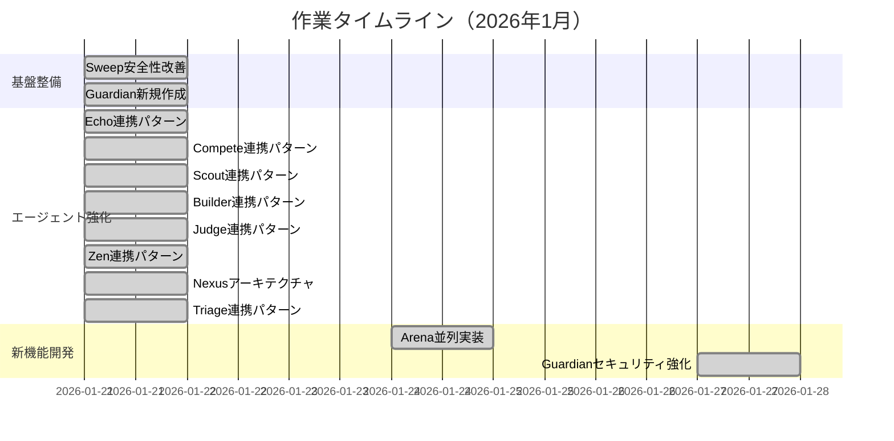
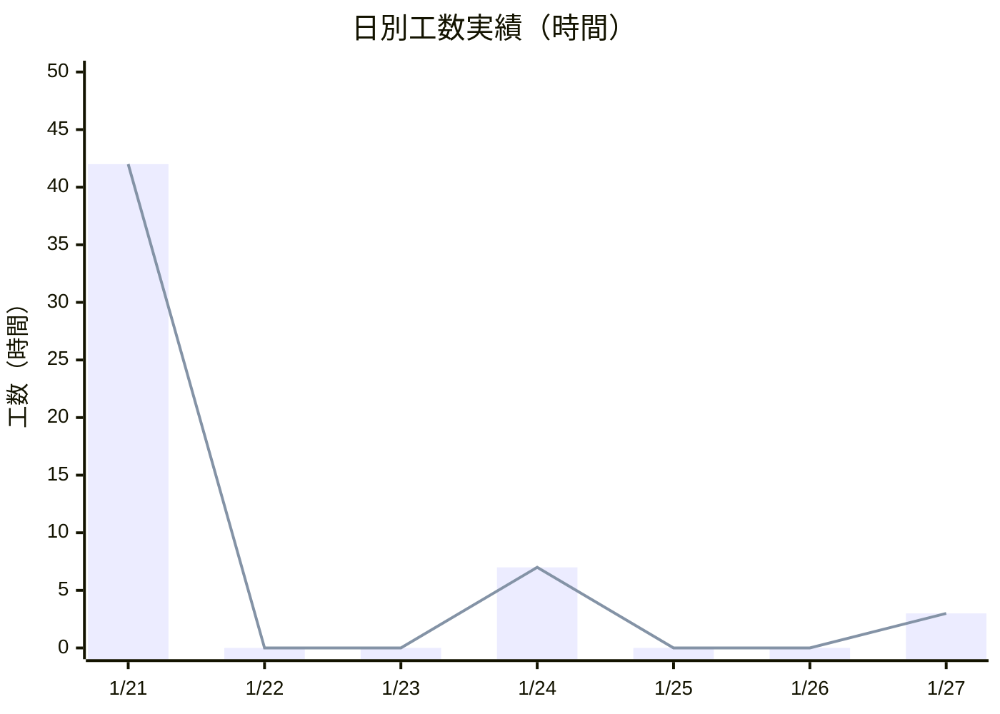
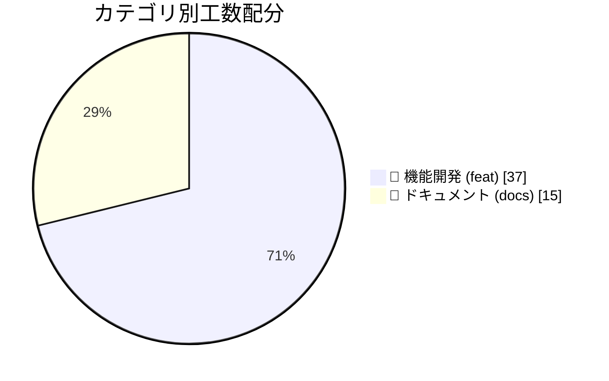

<head>
<style>
:root {
  --primary: #2563eb;
  --secondary: #64748b;
  --success: #22c55e;
  --warning: #f59e0b;
  --border: #e2e8f0;
  --bg-subtle: #f8fafc;
}
</style>
</head>

# 作業報告書

<div align="center">

━━━━━━━━━━━━━━━━━━━━━━━━━━━━━━━━━━━━━━━━━━━━━━━━━━━━━━━━━━━

**プロジェクト:** Agent Skills 開発
**報告期間:** 2026年1月21日 〜 2026年1月31日
**報告日:** 2026年1月31日
**担当者:** simota

━━━━━━━━━━━━━━━━━━━━━━━━━━━━━━━━━━━━━━━━━━━━━━━━━━━━━━━━━━━

</div>

---

## 📊 エグゼクティブサマリー

<table>
<tr>
<td width="25%" align="center">
<h3>12</h3>
<sub>完了タスク</sub>
</td>
<td width="25%" align="center">
<h3>52.0h</h3>
<sub>総工数</sub>
</td>
<td width="25%" align="center">
<h3>+8,141</h3>
<sub>追加行数</sub>
</td>
<td width="25%" align="center">
<h3>100%</h3>
<sub>完了率</sub>
</td>
</tr>
</table>

---

## 📅 作業タイムライン



---

## 📈 日別作業実績



| 日付 | 工数 | 作業内容 |
|:----:|-----:|---------|
| 01/21 | 42.0h | 基盤整備・10エージェント強化 |
| 01/24 | 7.0h | Arena新規作成 |
| 01/27 | 3.0h | Guardianセキュリティ強化 |
| **合計** | **52.0h** | |

---

## 🗂️ カテゴリ別工数



| カテゴリ | タスク数 | 工数 | 割合 |
|:--------:|:--------:|-----:|-----:|
| 🚀 機能開発 | 11件 | 37.0h | 71.2% |
| 📝 ドキュメント | 1件 | 15.0h | 28.8% |
| **合計** | **12件** | **52.0h** | **100%** |

---

## 📋 作業詳細

### 完了タスク一覧

| No. | タスク名 | カテゴリ | 工数 | 完了日 | ステータス |
|:---:|---------|:--------:|-----:|:------:|:----------:|
| 1 | Sweep スキル安全性・使いやすさ改善 | 📝 docs | 15.0h | 01/21 | ✅ 完了 |
| 2 | Guardian Git/PR管理エージェント新規作成 | 🚀 feat | 8.0h | 01/21 | ✅ 完了 |
| 3 | Echo 高度な連携パターン追加 | 🚀 feat | 10.0h | 01/21 | ✅ 完了 |
| 4 | Compete 高度な連携パターン追加 | 🚀 feat | 5.0h | 01/21 | ✅ 完了 |
| 5 | Scout 高度な連携パターン追加 | 🚀 feat | 5.0h | 01/21 | ✅ 完了 |
| 6 | Builder 高度な連携パターン追加 | 🚀 feat | 6.5h | 01/21 | ✅ 完了 |
| 7 | Judge 高度な連携パターン追加 | 🚀 feat | 5.5h | 01/21 | ✅ 完了 |
| 8 | Zen 高度な連携パターン追加 | 🚀 feat | 5.0h | 01/21 | ✅ 完了 |
| 9 | Nexus 高度な連携アーキテクチャ追加 | 🚀 feat | 3.0h | 01/21 | ✅ 完了 |
| 10 | Triage 高度な連携パターン追加 | 🚀 feat | 6.5h | 01/21 | ✅ 完了 |
| 11 | Arena マルチエンジン並列実装エージェント | 🚀 feat | 7.0h | 01/24 | ✅ 完了 |
| 12 | Guardian セキュリティ分析・大規模PR対応 | 🚀 feat | 3.0h | 01/27 | ✅ 完了 |

---

## 📊 成果サマリー

### 主要成果物

```
┌─────────────────────────────────────────────────────────────────┐
│                                                                 │
│  ✅ 新規エージェント作成                                          │
│     • Guardian: Git/PR管理の番人                                 │
│     • Arena: 複数AIエンジン並列実装                               │
│                                                                 │
│  ✅ 既存エージェント強化                                          │
│     • 10エージェントに高度な連携パターンを追加                      │
│     • NEXUS_HANDOFF形式の標準化                                  │
│     • AUTORUN Supportの実装                                     │
│                                                                 │
│  ✅ アーキテクチャ改善                                            │
│     • Nexusオーケストレーターの連携アーキテクチャ整備               │
│     • エージェント間の双方向連携定義                               │
│                                                                 │
└─────────────────────────────────────────────────────────────────┘
```

### 定量的成果

| 指標 | 値 | 備考 |
|------|---:|------|
| 強化エージェント数 | 11 | 全41エージェント中 |
| 新規エージェント数 | 2 | Guardian, Arena |
| 追加コード行数 | +8,141 | ドキュメント含む |
| 削除コード行数 | -748 | リファクタリング |
| PR完了率 | 100% | 12/12件 |

---

## 📆 次期予定

| 優先度 | タスク | 見込み工数 | 予定期間 |
|:------:|--------|----------:|---------|
| 🔴 高 | Harvest PR収集エージェント作成 | 8.0h | 01/31 |
| 🟡 中 | 残りエージェントの連携パターン追加 | 20.0h | 02/01-02/07 |
| 🟢 低 | ドキュメント整備 | 8.0h | 02/08-02/14 |

---

<div align="center">

━━━━━━━━━━━━━━━━━━━━━━━━━━━━━━━━━━━━━━━━━━━━━━━━━━━━━━━━━━━

**以上**

*本報告書は Harvest Agent により自動生成されました*

━━━━━━━━━━━━━━━━━━━━━━━━━━━━━━━━━━━━━━━━━━━━━━━━━━━━━━━━━━━

</div>
