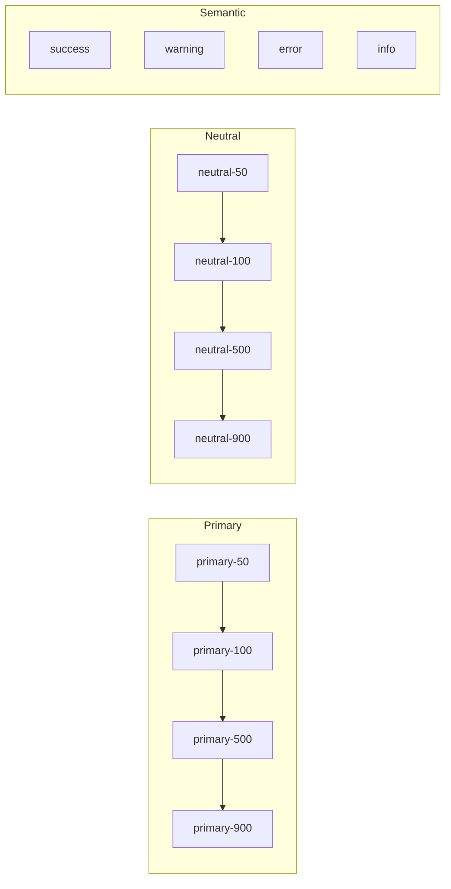

# Design System Construction

Layers, file structure, construction phases, health metrics, and framework integration.

---

## Design System Layers

```
Layer 1: FOUNDATIONS (Muse owns)
├── Design Tokens (colors, spacing, typography, effects)
├── CSS Reset / Normalize
├── Base Typography Styles
└── Utility Classes (optional)

Layer 2: COMPONENTS (Muse + Forge collaborate)
├── Atomic Components (Button, Input, Badge, Icon)
├── Molecular Components (Card, Form Field, List Item)
└── Organism Components (Header, Sidebar, Modal)

Layer 3: PATTERNS (Muse + Artisan collaborate)
├── Layout Patterns (Grid, Stack, Cluster)
├── Interaction Patterns (Navigation, Forms, Feedback)
└── Composition Patterns (Page templates)

Layer 4: DOCUMENTATION (Muse + Showcase collaborate)
├── Token Reference
├── Component Catalog
├── Usage Guidelines
└── Brand Guidelines
```

---

## File Structure

```
design-system/
├── tokens/                    # Layer 1: Foundations
│   ├── primitives/
│   └── semantic/
├── styles/
│   ├── reset.css
│   ├── base.css              # Base typography, links
│   └── utilities.css         # Optional utility classes
├── components/               # Layer 2: Components
│   ├── button/
│   │   ├── button.css
│   │   └── button.stories.tsx
│   └── ...
├── patterns/                 # Layer 3: Patterns
│   ├── layouts/
│   └── compositions/
└── docs/                     # Layer 4: Documentation
    ├── tokens.md
    ├── components.md
    └── guidelines.md
```

---

## Construction Phases

### Phase 1: Token Foundation
1. Audit existing codebase for colors, spacing, typography in use
2. Define primitive token scales (color palette, spacing grid, type scale)
3. Create semantic token layer mapping primitives to use cases
4. Implement dark mode token variants

### Phase 2: Base Styles
1. Establish CSS reset/normalize
2. Define base typography (body, headings, links)
3. Create foundational utility classes if needed

### Phase 3: Component Tokenization
1. Identify core components in the codebase
2. Replace hardcoded values with tokens
3. Document component token usage
4. Ensure dark mode compatibility

### Phase 4: Documentation & Governance
1. Create token reference documentation
2. Establish contribution guidelines
3. Set up design-dev handoff process
4. Define token deprecation strategy

---

## Health Metrics

| Metric | Target | How to Measure |
|--------|--------|----------------|
| Token Coverage | 95%+ | Audit for hardcoded values |
| Dark Mode Support | 100% | Checklist verification |
| Component Token Usage | 100% | No magic numbers in components |
| Documentation Currency | < 1 sprint | Last update date |

---

## Framework Integration

### CSS Custom Properties (Universal)

```css
:root {
  --color-primary: #3b82f6;
  --space-4: 1rem;
}
```

### Tailwind CSS (v3)

```js
// tailwind.config.js
module.exports = {
  theme: {
    extend: {
      colors: {
        primary: 'var(--color-primary)',
      },
      spacing: {
        4: 'var(--space-4)',
      }
    }
  }
}
```

### Tailwind CSS v4 (CSS-first)

```css
@import "tailwindcss";

@theme {
  --color-primary: #3b82f6;
  --color-bg-primary: var(--color-neutral-50);
  --spacing-4: 1rem;
  --radius-md: 0.375rem;
}
```

### Panda CSS

```ts
import { defineConfig } from '@pandacss/dev';

export default defineConfig({
  theme: {
    tokens: {
      colors: {
        primary: { value: '#3b82f6' },
      },
    },
    semanticTokens: {
      colors: {
        bg: {
          primary: {
            value: { base: '{colors.neutral.50}', _dark: '{colors.neutral.900}' },
          },
        },
      },
    },
  },
});
```

### CSS Modules

```css
/* button.module.css */
.button {
  padding: var(--space-2) var(--space-4);
  background: var(--color-primary);
  border-radius: var(--radius-md);
  color: var(--color-text-inverse);
}
```

### Vue / Svelte Scoped Styles

```vue
<style scoped>
.card {
  padding: var(--space-4);
  background: var(--color-bg-primary);
  border-radius: var(--radius-lg);
}
</style>
```

---

## Canvas Integration

### Color Palette Diagram



### Typography Scale Diagram

```
Typography Scale (Major Third 1.25)

Display (60px)  ████████████████████████████████
H1 (48px)       ██████████████████████████
H2 (36px)       ████████████████████
H3 (30px)       ████████████████
H4 (24px)       █████████████
H5 (20px)       ███████████
H6 (18px)       ██████████
Body (16px)     █████████
Small (14px)    ████████
Caption (12px)  ██████
```

### Spacing System Diagram

```
8px Grid System

┌──────────────────────────────────────────────────┐
│ space-16 (64px)                                  │
│  ┌────────────────────────────────────────────┐  │
│  │ space-12 (48px)                            │  │
│  │  ┌──────────────────────────────────────┐  │  │
│  │  │ space-8 (32px)                       │  │  │
│  │  │  ┌────────────────────────────────┐  │  │  │
│  │  │  │ space-4 (16px)                │  │  │  │
│  │  │  │  ┌──────────────────────────┐  │  │  │  │
│  │  │  │  │ space-2 (8px)           │  │  │  │  │
│  │  │  │  │  ┌────────────────────┐  │  │  │  │  │
│  │  │  │  │  │ space-1 (4px)     │  │  │  │  │  │
```
