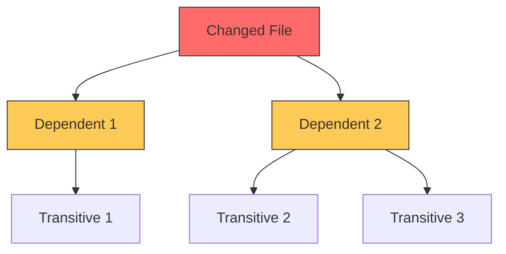

# Impact Report Template

Vertical impact analysis report focusing on dependency tracking and affected files.

## Usage

Use this template when the focus is on:
- "What files will this change affect?"
- "What are the dependencies?"
- "Is this a breaking change?"

## Template

```markdown
# Impact Analysis Report

## Change Summary

**Proposed Change:** [Brief description of the change]
**Target File(s):** [Primary file(s) being modified]
**Change Type:** [New Feature | Modification | Refactoring | Deletion | Rename]

---

## Dependency Graph

### Visual Representation

```
[Changed File]
       │
       ├──► [Direct Dependent 1]
       │           │
       │           └──► [Transitive 1.1]
       │
       ├──► [Direct Dependent 2]
       │           │
       │           ├──► [Transitive 2.1]
       │           │
       │           └──► [Transitive 2.2]
       │
       └──► [Direct Dependent 3]
```

### Mermaid Diagram (if complex)



---

## Affected Files

### Level 0: Changed Files (Source of Change)

| File | Change Description | Risk |
|------|-------------------|------|
| `src/path/to/file.ts` | [What changes] | [LOW/MED/HIGH] |

### Level 1: Direct Dependents

| File | Import Statement | Impact Type |
|------|-----------------|-------------|
| `src/dependent1.ts` | `import { X } from './file'` | [Type/Function/Constant] |
| `src/dependent2.ts` | `import { Y } from './file'` | [Type/Function/Constant] |

**Total Direct Dependents:** X files

### Level 2: Transitive Dependents

| File | Depends On | Distance |
|------|-----------|----------|
| `src/transitive1.ts` | `dependent1.ts` | 2 |
| `src/transitive2.ts` | `dependent2.ts` | 2 |

**Total Transitive Dependents:** Y files

### Test Files in Scope

| Test File | Covers | Current Status |
|-----------|--------|----------------|
| `src/__tests__/file.test.ts` | Changed file | Update required |
| `src/__tests__/dependent1.test.ts` | Direct dependent | May need update |

**Total Test Files:** Z files

---

## Breaking Change Analysis

### Exported API Changes

| Export | Change Type | Breaking? | Dependents Affected |
|--------|-------------|-----------|---------------------|
| `functionA` | Signature change | YES | 5 files |
| `TypeB` | Property added | NO | - |
| `constantC` | Removed | YES | 2 files |

### Breaking Change Details

#### 1. [Export Name] - [Change Type]

**Current Signature:**
```typescript
export function functionA(param1: string): Result
```

**New Signature:**
```typescript
export function functionA(param1: string, param2?: Options): Result
```

**Impact Assessment:**
- Dependent files requiring update: X
- Estimated effort: [Low/Medium/High]
- Migration path: [Description]

**Affected Files:**
1. `src/consumer1.ts:45` - Direct call
2. `src/consumer2.ts:23` - Direct call
3. `src/consumer3.ts:78` - Passed as callback

---

## Cascade Effects

### Potential Side Effects

| Effect | Likelihood | Severity | Detection |
|--------|------------|----------|-----------|
| Runtime type error | Medium | High | TypeScript compiler |
| Test failures | High | Low | Test suite |
| Build failure | Low | High | CI/CD |

### Hidden Dependencies

| Dependency Type | Description | Risk |
|-----------------|-------------|------|
| Dynamic imports | `import()` not caught by static analysis | Medium |
| String references | Module name as string | Low |
| Configuration | Referenced in config files | Low |

---

## Impact Metrics

| Metric | Value | Assessment |
|--------|-------|------------|
| Total Files Affected | X | [Low < 5, Medium 5-15, High > 15] |
| Direct Dependents | Y | |
| Transitive Dependents | Z | |
| Breaking Changes | N | |
| Test Coverage of Affected | P% | [Good > 80%, Moderate 50-80%, Poor < 50%] |

---

## Risk Score (Vertical)

| Factor | Score (1-10) | Justification |
|--------|--------------|---------------|
| **Impact Scope** | X | [N files affected] |
| **Breaking Potential** | Y | [N breaking changes] |
| **Dependency Depth** | Z | [Max depth: N levels] |
| **Test Coverage** | W | [P% coverage] |

**Vertical Impact Score:** X.X / 10

---

## Recommendations

### Before Implementation

1. [ ] Update all breaking change consumers
2. [ ] Add/update tests for affected areas
3. [ ] Consider compatibility layer for breaking changes

### Files Requiring Pre-Change Tests (via Radar)

- `src/dependent1.ts` - No existing tests
- `src/dependent2.ts` - Coverage < 50%

### Suggested Implementation Order

1. **Phase 1:** Update type definitions
2. **Phase 2:** Update implementation
3. **Phase 3:** Update direct dependents
4. **Phase 4:** Verify transitive dependents

---

## Commands Used

```bash
# Find direct dependents
grep -rl "from.*changed-module" src --include="*.ts"

# Dependency tree
npx madge --depends-on src/path/to/file.ts src/

# Reverse dependencies
npx madge --why src/path/to/file.ts src/
```
```

## Quick Reference Checklist

- [ ] All direct dependents identified
- [ ] Transitive dependencies traced (2+ levels)
- [ ] Breaking changes explicitly listed
- [ ] Test files in scope identified
- [ ] Risk score calculated with evidence
- [ ] Recommendations are actionable
