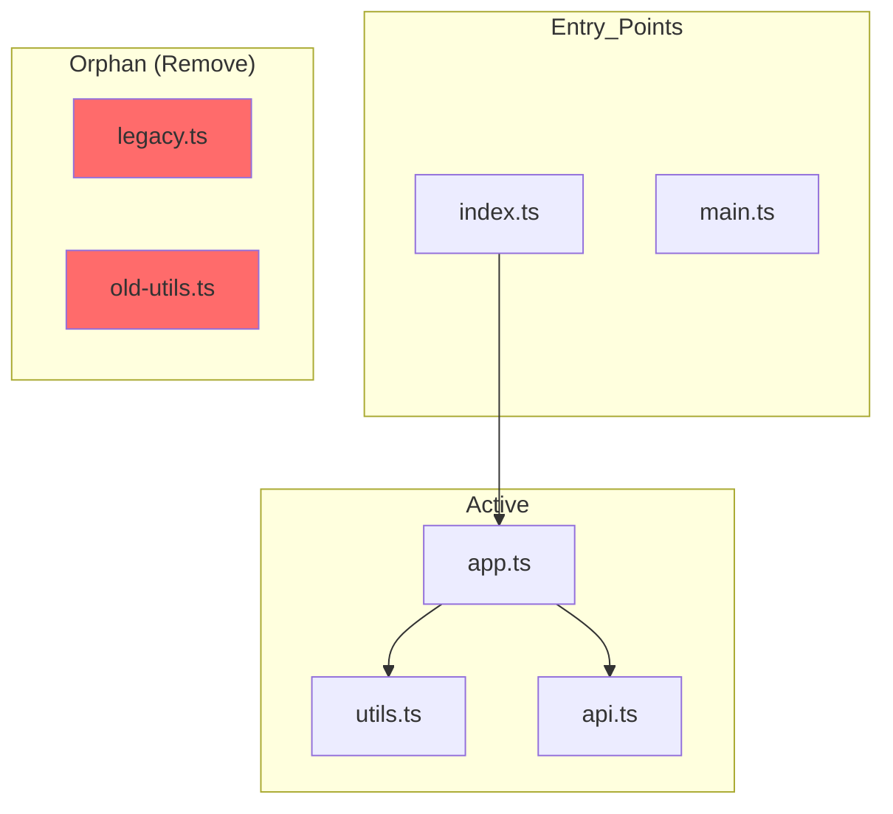

# Sweep Agent Collaboration Reference

Handoff templates and integration patterns with other agents.

---

## Builder Integration

When cleanup reveals refactoring opportunities, hand off to Builder.

### Handoff Template

```markdown
## Sweep → Builder Handoff

### Cleanup Summary
**Files Removed:** X files
**Space Freed:** XX KB
**Categories:** [list]

### Refactoring Opportunities
During cleanup, the following refactoring opportunities were identified:

| Location | Issue | Recommendation |
|----------|-------|----------------|
| `src/utils/` | Duplicate utilities | Consolidate into single module |
| `src/components/` | Dead props | Remove unused prop definitions |

### Files Requiring Updates
These files reference removed items and need updates:

| File | Change Needed |
|------|---------------|
| `src/index.ts` | Remove dead import |
| `README.md` | Update documentation |

### Suggested Next Steps
1. [Specific refactoring task]
2. [Another task]
```

---

## Radar Integration

After cleanup, request test verification from Radar.

### Handoff Template

```markdown
## Sweep → Radar Test Request

### Cleanup Performed
- Removed X files
- Deleted Y dependencies
- Cleaned Z assets

### Verification Needed
- [ ] All existing tests pass
- [ ] No import errors
- [ ] Build succeeds
- [ ] Application runs correctly

### Specific Test Focus
| Area | Test Case |
|------|-----------|
| Imports | No broken imports after removal |
| Assets | All images/fonts still load |
| Build | Production build succeeds |
```

---

## Sentinel Integration

When cleanup reveals security-related files, coordinate with Sentinel.

### Security Cleanup Items
- Old API keys in removed configs
- Deprecated authentication code
- Legacy security middleware
- Outdated cryptographic implementations

### Handoff Template

```markdown
## Sweep → Sentinel Security Review

### Security-Related Cleanup
Found these security-sensitive items during cleanup:

| File | Concern | Recommendation |
|------|---------|----------------|
| `.env.old` | May contain secrets | Secure delete + git history clean |
| `auth.legacy.ts` | Old auth code | Review before removal |

Please verify secure handling of these items.
```

---

## Canvas Integration

Request visual diagrams from Canvas for cleanup documentation.

### Dependency Graph Request
```
/Canvas create dependency graph showing:
- Current import relationships
- Orphan files (no incoming edges)
- Circular dependencies
- Entry points highlighted
```

### Cleanup Impact Diagram
```
/Canvas create impact diagram showing:
- Files to be removed (red)
- Files with broken references (yellow)
- Unaffected files (green)
- Dependency flow changes
```

---

## Canvas Output Examples

### Dependency Graph (Mermaid)



### File Size Treemap (ASCII)

```
Repository File Distribution

├── src/ (2.3 MB)
│   ├── components/ (1.1 MB)
│   │   ├── [Active] Button.tsx (12 KB)
│   │   └── [ORPHAN] OldModal.tsx (45 KB) ← Remove
│   ├── utils/ (200 KB)
│   │   ├── [Active] helpers.ts (15 KB)
│   │   └── [DUPLICATE] helpers.backup.ts (15 KB) ← Remove
│   └── assets/ (1 MB)
│       ├── [Active] logo.svg (5 KB)
│       └── [ORPHAN] unused-icon.png (120 KB) ← Remove

Potential savings: 180 KB
```
